# ICT Balanced-Subset Continuity Evaluation

Date: `2026-04-13`

Report order note:

- this is a later same-day follow-up report
- it extends the earlier compact continuity report to the balanced multi-target subset and now includes both offline-smoothed and `fixedlag5` runtime-style plots

## Scope

This report reruns the current ICT continuity workflow on the new balanced multi-target subset defined here:

- [`2026-04-13-ict-balanced-subset-inventory.md`](/home/kara4/demo/acies-os/docs/design/ict_tracker/2026-04-13-ict-balanced-subset-inventory.md)

Balanced-eval artifacts live under:

- [`docs/design/artifacts/ict_tracker_2026-04-13_balanced_eval/continuity_layer`](/home/kara4/demo/acies-os/docs/design/artifacts/ict_tracker_2026-04-13_balanced_eval/continuity_layer)

Preview note:

- inline images below use standard relative paths from `docs/design/ict_tracker/` to `../artifacts/...`
- if your markdown preview still renders them poorly, use the direct plot links listed under each run
- each run now shows two cases:
- `smoothed continuity`: offline smoother, aligned to sample timestamps, may use future evidence
- `fixedlag5 continuity`: bounded-lag runtime-style estimate, closer to realistic inference output

Most relevant outputs:

- [`continuity_summary.csv`](/home/kara4/demo/acies-os/docs/design/artifacts/ict_tracker_2026-04-13_balanced_eval/continuity_layer/continuity_summary.csv)
- [`continuity_per_run_summary.csv`](/home/kara4/demo/acies-os/docs/design/artifacts/ict_tracker_2026-04-13_balanced_eval/continuity_layer/continuity_per_run_summary.csv)
- [`loop_comparison_summary.csv`](/home/kara4/demo/acies-os/docs/design/artifacts/ict_tracker_2026-04-13_balanced_eval/continuity_layer/loop_comparison_summary.csv)

Important note:

- because the balanced subset contains all `8` currently usable runs, the aggregate summary is the same pooled all-run result as the existing `2026-04-13` continuity evaluation
- the value of this rerun is that the subset selection is now explicit and balanced by target, and the compact trace report now covers all four vehicle labels instead of only `mustang` and `gle350`

Fixed-lag clarification:

- `smoothed_hybrid_mic` is an offline smoother and may use future evidence from later samples
- `fixedlag5_smoothed_hybrid_mic` is the runtime-oriented bounded-lag approximation
- `fixedlag5` is more realistic for inference than the offline smoother, but it is still not zero-lookahead causal
- in this implementation with roughly `1 s` sample spacing, the estimate for sample `k` is typically finalized when sample `k+5` arrives
- so a prediction attached to sample time `T` is usually available around `T + 5 s`, except near the end of a plotted segment where the remaining tail is flushed with less lookahead
- the updated `fixedlag5` XY plots therefore show both the sample timestamp and an approximate finalization timestamp

## Aggregate Summary

From [`continuity_summary.csv`](/home/kara4/demo/acies-os/docs/design/artifacts/ict_tracker_2026-04-13_balanced_eval/continuity_layer/continuity_summary.csv):

| Mode | Joint Station+Side Acc | Mean XY Error (m) | Mean Step (m) | P95 Step (m) |
| --- | ---: | ---: | ---: | ---: |
| `hybrid_mic` | `0.325` | `64.96` | `33.29` | `159.83` |
| `causal_hybrid_mic` | `0.370` | `56.92` | `21.00` | `121.23` |
| `smoothed_hybrid_mic` | `0.418` | `48.02` | `7.66` | `27.04` |
| `fixedlag5_smoothed_hybrid_mic` | `0.419` | `47.93` | `10.68` | `29.70` |

Continuity-first reading:

- the continuity layer still looks clearly better than raw `hybrid_mic` on the broader multi-target set
- the main gain is still geometric coherence: mean step size drops from `33.29 m` to `10.68 m`
- the `fixedlag5_smoothed_hybrid_mic` runtime candidate stays very close to the offline smoother on pooled metrics

## Label-Level Reading

From [`continuity_per_run_summary.csv`](/home/kara4/demo/acies-os/docs/design/artifacts/ict_tracker_2026-04-13_balanced_eval/continuity_layer/continuity_per_run_summary.csv), averaged within label for `fixedlag5_smoothed_hybrid_mic`:

| Label | Mean Joint Acc | Mean XY Error (m) | Mean Step (m) | Reading |
| --- | ---: | ---: | ---: | --- |
| `mustang` | `0.570` | `31.41` | `11.03` | strongest label overall |
| `gle350` | `0.424` | `46.90` | `10.99` | good continuity, moderate error |
| `miata` | `0.368` | `51.56` | `10.42` | continuity still useful but weaker |
| `cx30` | `0.353` | `58.15` | `10.15` | weakest label under pooled templates |

Interpretation:

- `mustang` remains the cleanest evidence that the current continuity layer is doing the right thing
- `gle350` still looks solid and remains the best non-`mustang` transfer label
- `miata` and `cx30` are the main caution labels on the broader set
- even on those harder labels, the path trace is still much more coherent than raw `hybrid_mic`; the degradation is mostly in how tightly the trace stays on the correct part of the loop

## Representative Loops

These figures use `best_smoothed` representative-loop selection.

### Run 0 (`mustang`)

Plots:

- [Run 0 smoothed clean XY](/home/kara4/demo/acies-os/docs/design/artifacts/ict_tracker_2026-04-13_balanced_eval/continuity_layer/run0_smoothed_continuity_clean_xy.png)
- [Run 0 smoothed timing](/home/kara4/demo/acies-os/docs/design/artifacts/ict_tracker_2026-04-13_balanced_eval/continuity_layer/run0_smoothed_continuity_timing.png)
- [Run 0 fixedlag5 clean XY](/home/kara4/demo/acies-os/docs/design/artifacts/ict_tracker_2026-04-13_balanced_eval/continuity_layer/run0_fixedlag5_continuity_clean_xy.png)
- [Run 0 fixedlag5 timing](/home/kara4/demo/acies-os/docs/design/artifacts/ict_tracker_2026-04-13_balanced_eval/continuity_layer/run0_fixedlag5_continuity_timing.png)

Smoothed continuity:

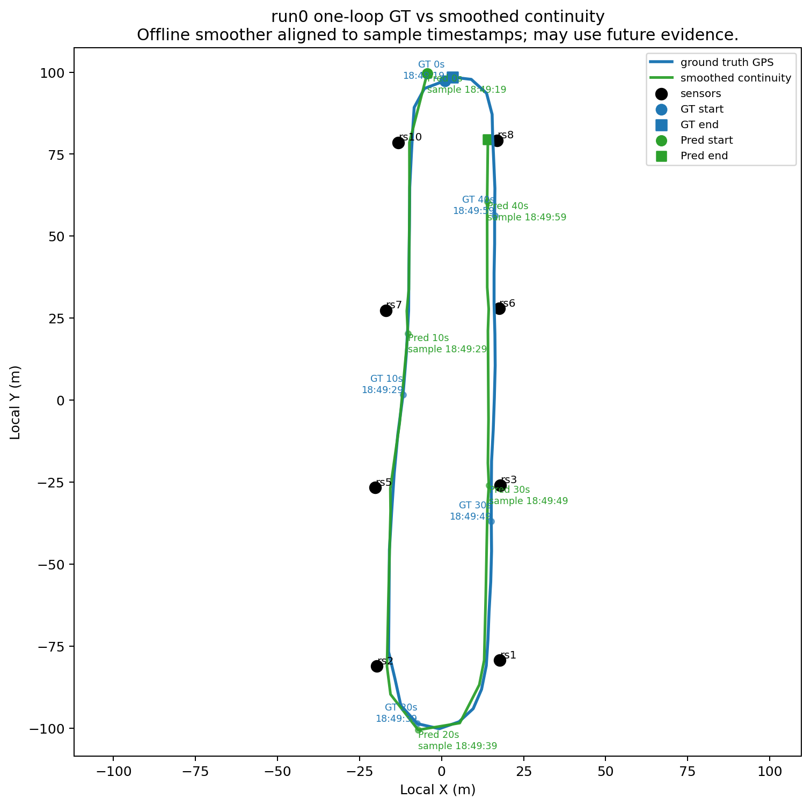

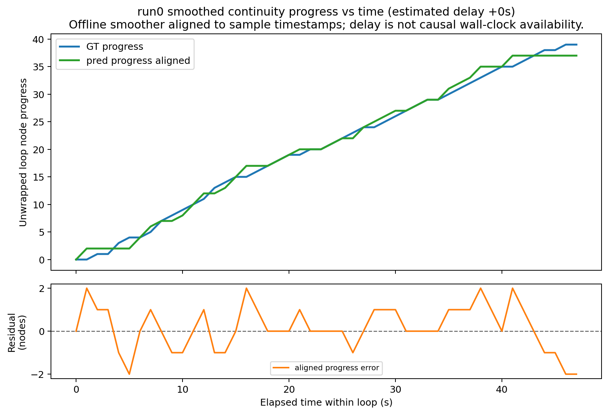

Fixedlag5 continuity:

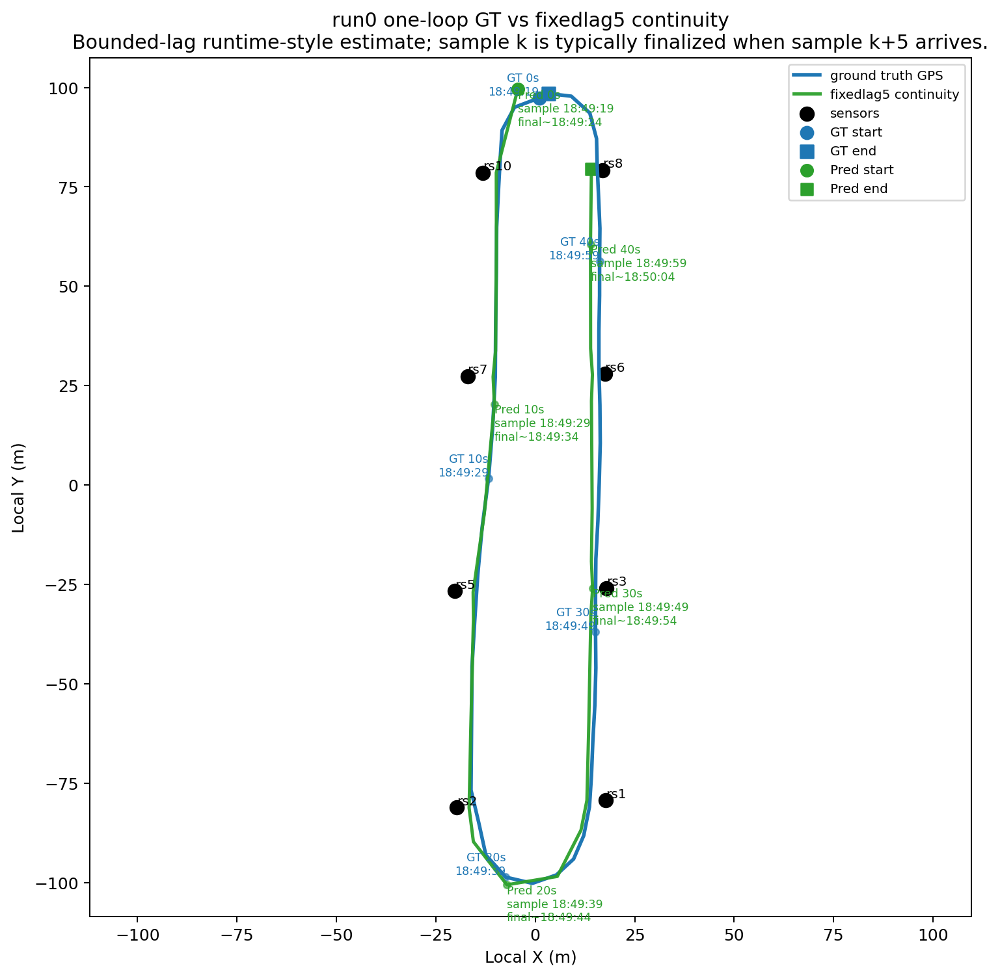

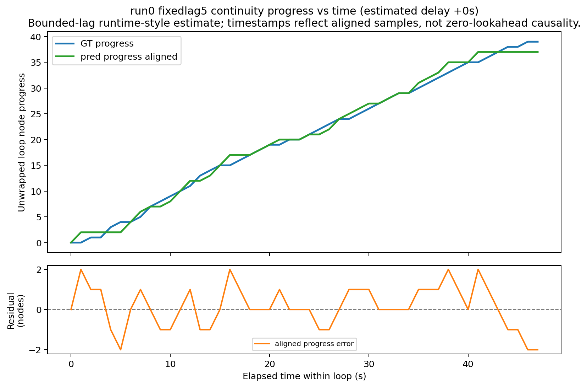

Interpretation:

- still one of the cleanest loops in the dataset
- runtime continuity stays close to the smoothed trace
- no meaningful delay is visible on the selected loop

### Run 1 (`mustang`)

Plots:

- [Run 1 smoothed clean XY](/home/kara4/demo/acies-os/docs/design/artifacts/ict_tracker_2026-04-13_balanced_eval/continuity_layer/run1_smoothed_continuity_clean_xy.png)
- [Run 1 smoothed timing](/home/kara4/demo/acies-os/docs/design/artifacts/ict_tracker_2026-04-13_balanced_eval/continuity_layer/run1_smoothed_continuity_timing.png)
- [Run 1 fixedlag5 clean XY](/home/kara4/demo/acies-os/docs/design/artifacts/ict_tracker_2026-04-13_balanced_eval/continuity_layer/run1_fixedlag5_continuity_clean_xy.png)
- [Run 1 fixedlag5 timing](/home/kara4/demo/acies-os/docs/design/artifacts/ict_tracker_2026-04-13_balanced_eval/continuity_layer/run1_fixedlag5_continuity_timing.png)

Smoothed continuity:

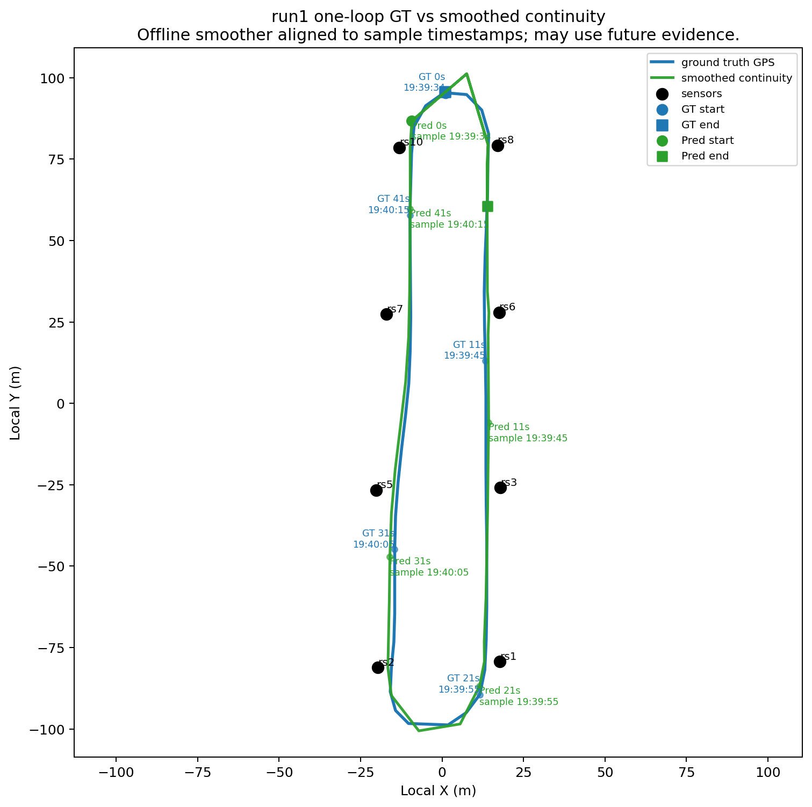

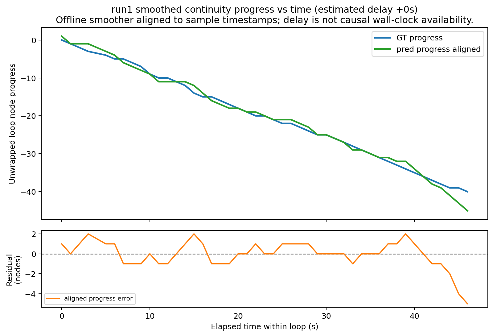

Fixedlag5 continuity:

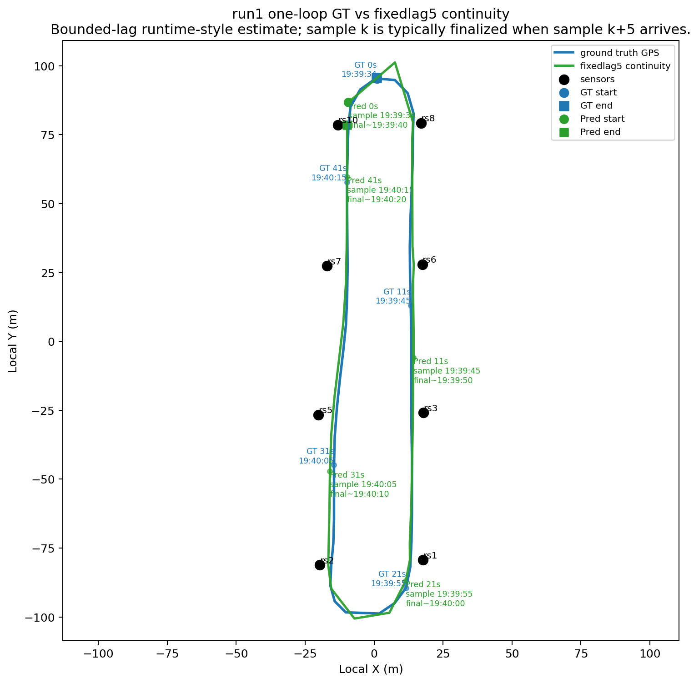

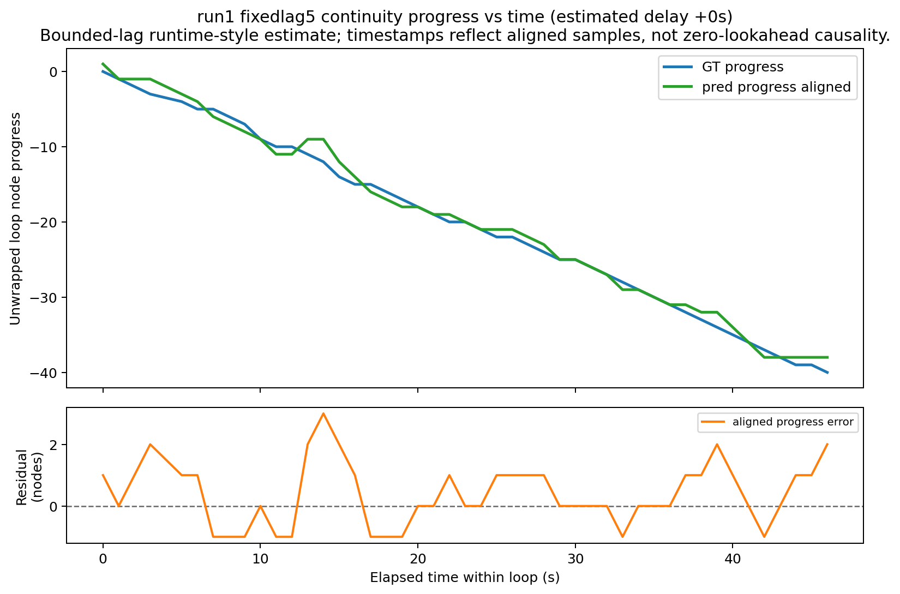

Interpretation:

- still a strong `mustang` run
- representative-loop continuity remains good
- the runtime approximation is slightly less clean than the full smoother, but still coherent

### Run 2 (`miata`)

Plots:

- [Run 2 smoothed clean XY](/home/kara4/demo/acies-os/docs/design/artifacts/ict_tracker_2026-04-13_balanced_eval/continuity_layer/run2_smoothed_continuity_clean_xy.png)
- [Run 2 smoothed timing](/home/kara4/demo/acies-os/docs/design/artifacts/ict_tracker_2026-04-13_balanced_eval/continuity_layer/run2_smoothed_continuity_timing.png)
- [Run 2 fixedlag5 clean XY](/home/kara4/demo/acies-os/docs/design/artifacts/ict_tracker_2026-04-13_balanced_eval/continuity_layer/run2_fixedlag5_continuity_clean_xy.png)
- [Run 2 fixedlag5 timing](/home/kara4/demo/acies-os/docs/design/artifacts/ict_tracker_2026-04-13_balanced_eval/continuity_layer/run2_fixedlag5_continuity_timing.png)

Smoothed continuity:

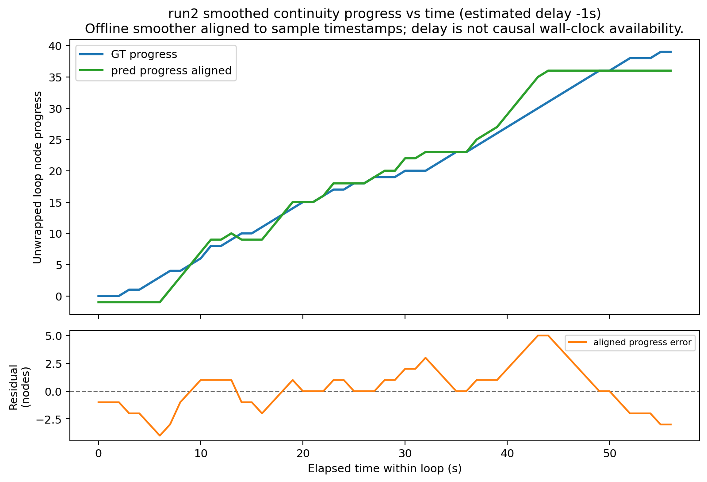

Fixedlag5 continuity:

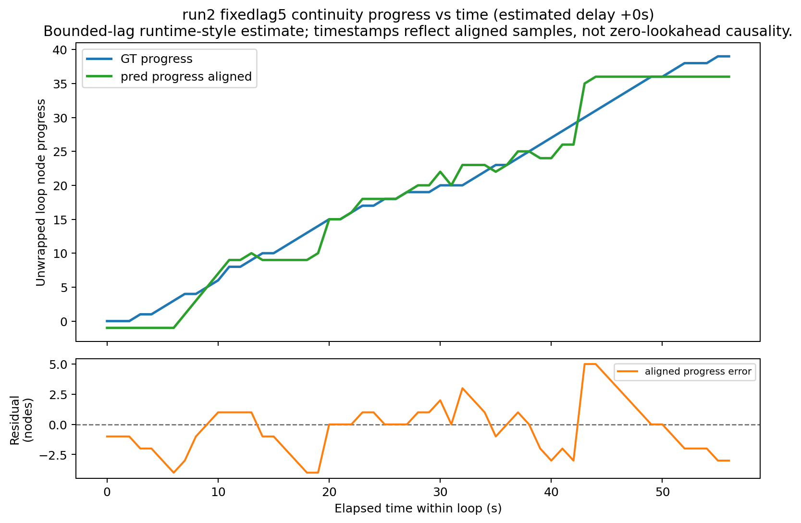

Interpretation:

- continuity is visibly weaker than `mustang` and `gle350`
- the path still follows the loop rather than jumping arbitrarily, but it is less tightly aligned
- this is one of the clearer examples where pooled-template continuity degrades

### Run 3 (`miata`)

Plots:

- [Run 3 smoothed clean XY](/home/kara4/demo/acies-os/docs/design/artifacts/ict_tracker_2026-04-13_balanced_eval/continuity_layer/run3_smoothed_continuity_clean_xy.png)
- [Run 3 smoothed timing](/home/kara4/demo/acies-os/docs/design/artifacts/ict_tracker_2026-04-13_balanced_eval/continuity_layer/run3_smoothed_continuity_timing.png)
- [Run 3 fixedlag5 clean XY](/home/kara4/demo/acies-os/docs/design/artifacts/ict_tracker_2026-04-13_balanced_eval/continuity_layer/run3_fixedlag5_continuity_clean_xy.png)
- [Run 3 fixedlag5 timing](/home/kara4/demo/acies-os/docs/design/artifacts/ict_tracker_2026-04-13_balanced_eval/continuity_layer/run3_fixedlag5_continuity_timing.png)

Smoothed continuity:

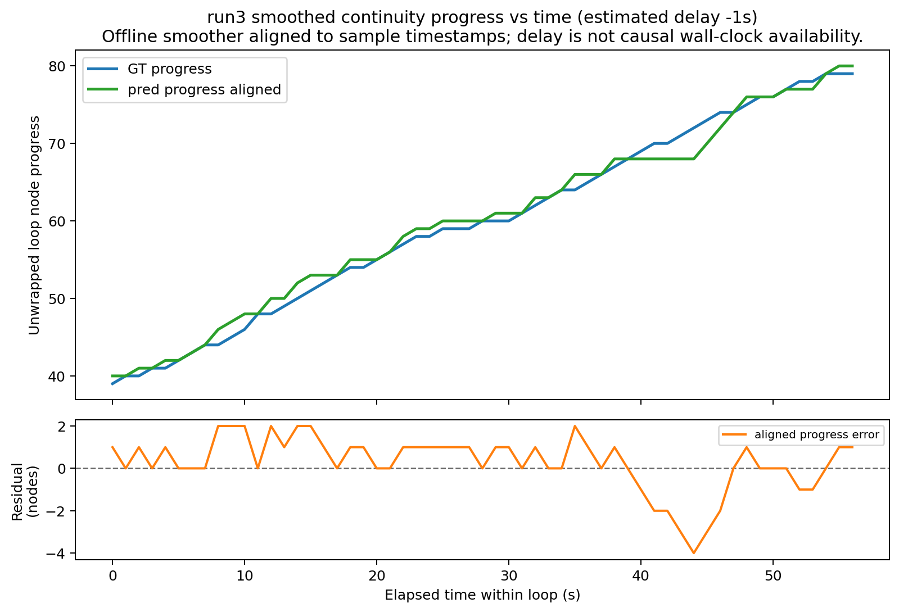

Fixedlag5 continuity:

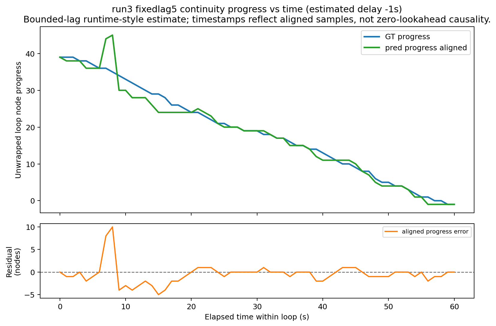

Interpretation:

- stronger than `run2`, but still below the `mustang` standard
- the selected loop is coherent and mostly delay-free, with an estimated shift of about `-1 s`
- this supports the view that `miata` is usable but not as robust under the current pooled templates

### Run 4 (`gle350`)

Plots:

- [Run 4 smoothed clean XY](/home/kara4/demo/acies-os/docs/design/artifacts/ict_tracker_2026-04-13_balanced_eval/continuity_layer/run4_smoothed_continuity_clean_xy.png)
- [Run 4 smoothed timing](/home/kara4/demo/acies-os/docs/design/artifacts/ict_tracker_2026-04-13_balanced_eval/continuity_layer/run4_smoothed_continuity_timing.png)
- [Run 4 fixedlag5 clean XY](/home/kara4/demo/acies-os/docs/design/artifacts/ict_tracker_2026-04-13_balanced_eval/continuity_layer/run4_fixedlag5_continuity_clean_xy.png)
- [Run 4 fixedlag5 timing](/home/kara4/demo/acies-os/docs/design/artifacts/ict_tracker_2026-04-13_balanced_eval/continuity_layer/run4_fixedlag5_continuity_timing.png)

Smoothed continuity:

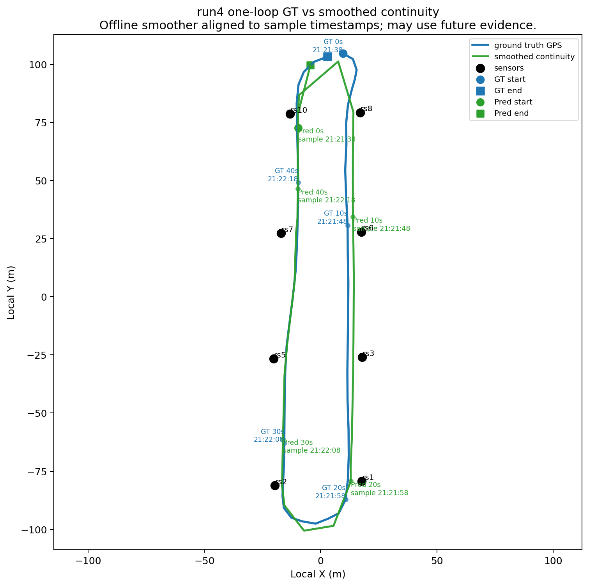

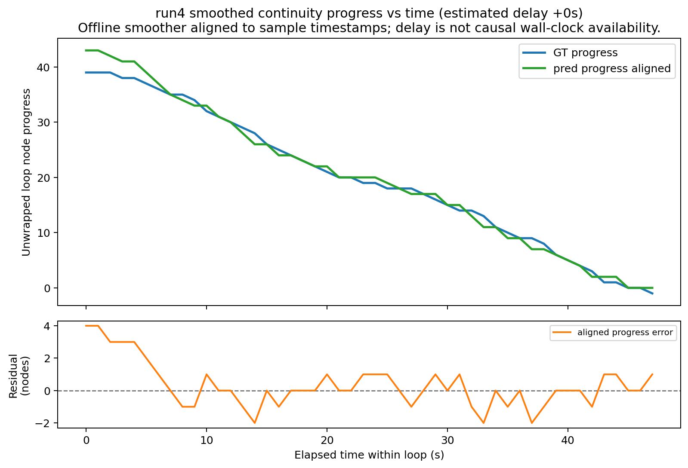

Fixedlag5 continuity:

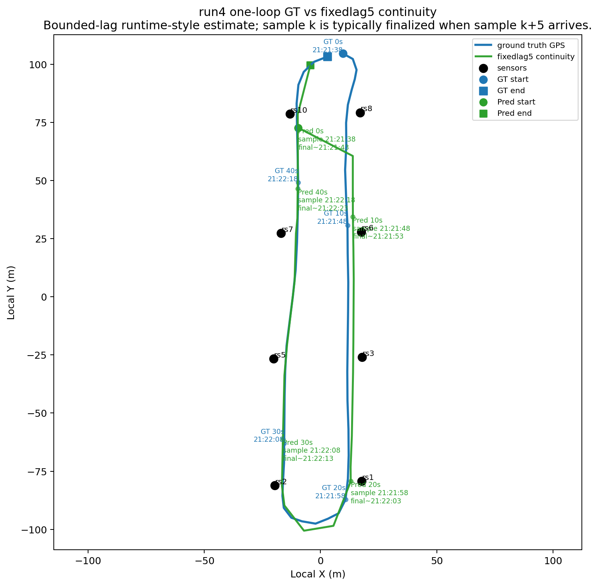

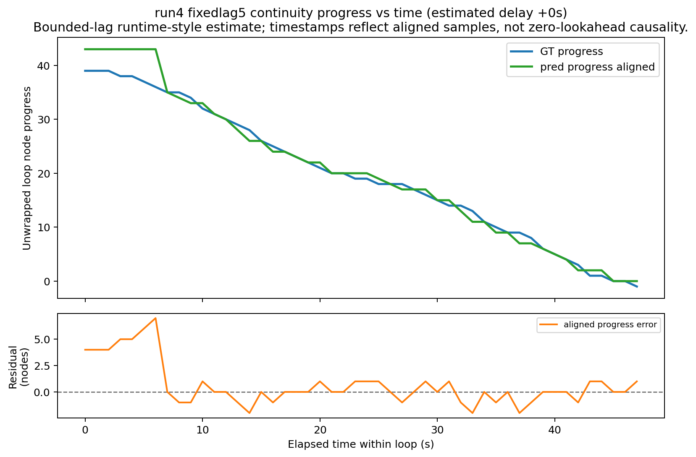

Interpretation:

- still the strongest non-`mustang` short run
- trace quality remains clean and loop-shaped
- this remains good evidence that the continuity layer transfers beyond a single vehicle

### Run 5 (`gle350`)

Plots:

- [Run 5 smoothed clean XY](/home/kara4/demo/acies-os/docs/design/artifacts/ict_tracker_2026-04-13_balanced_eval/continuity_layer/run5_smoothed_continuity_clean_xy.png)
- [Run 5 smoothed timing](/home/kara4/demo/acies-os/docs/design/artifacts/ict_tracker_2026-04-13_balanced_eval/continuity_layer/run5_smoothed_continuity_timing.png)
- [Run 5 fixedlag5 clean XY](/home/kara4/demo/acies-os/docs/design/artifacts/ict_tracker_2026-04-13_balanced_eval/continuity_layer/run5_fixedlag5_continuity_clean_xy.png)
- [Run 5 fixedlag5 timing](/home/kara4/demo/acies-os/docs/design/artifacts/ict_tracker_2026-04-13_balanced_eval/continuity_layer/run5_fixedlag5_continuity_timing.png)

Smoothed continuity:

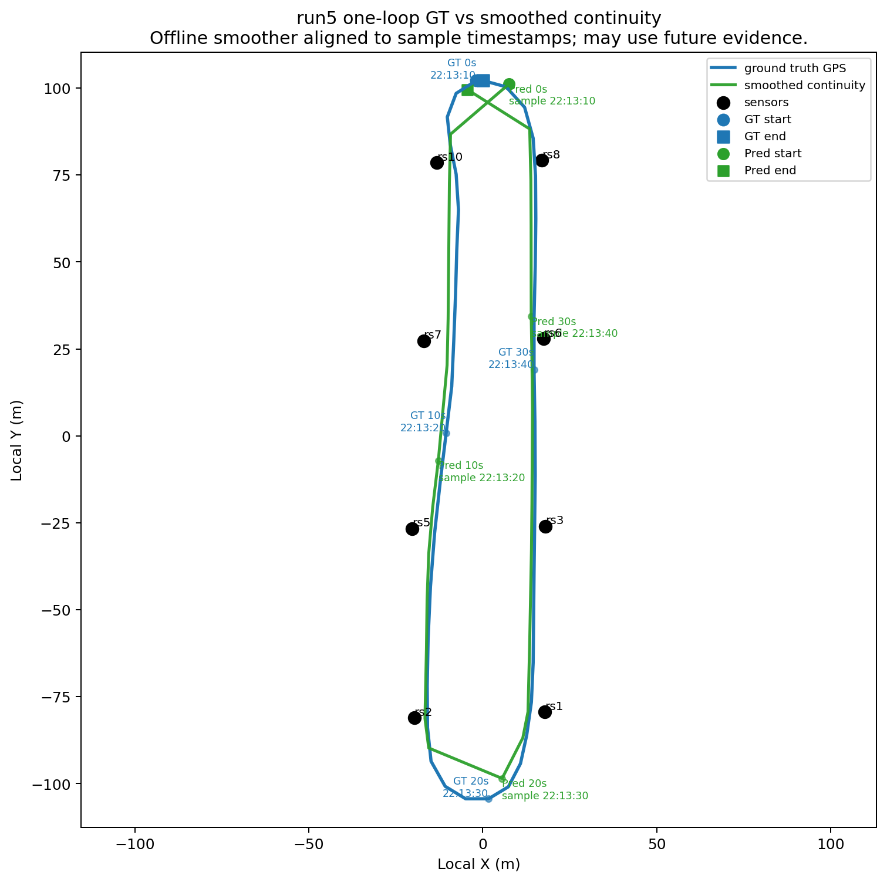

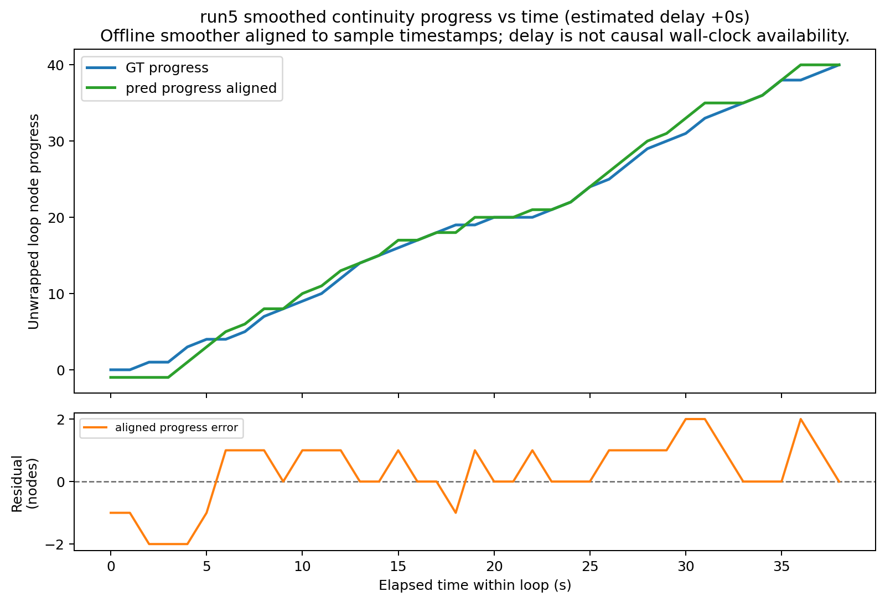

Fixedlag5 continuity:

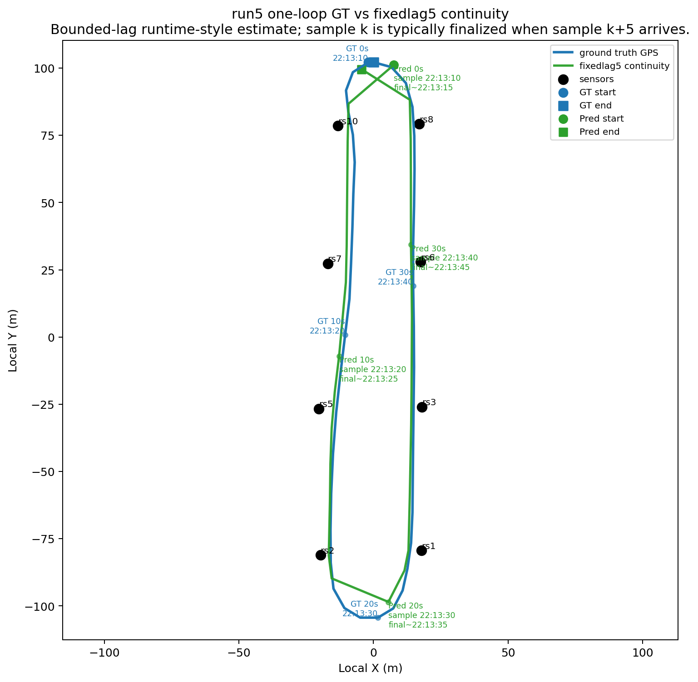

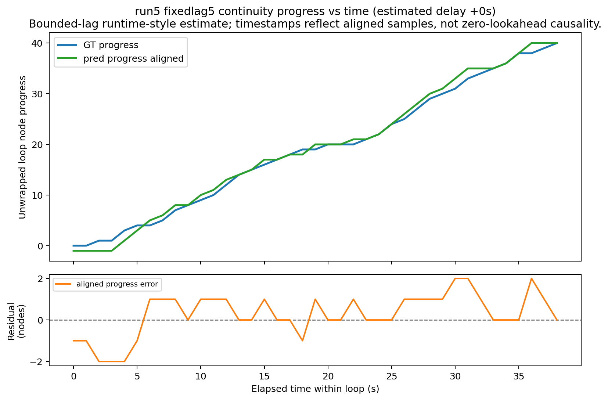

Interpretation:

- still acceptable on the representative loop
- weaker than `run4`, but the trace remains coherent
- no meaningful extra delay is visible

### Run 6 (`cx30`)

Plots:

- [Run 6 smoothed clean XY](/home/kara4/demo/acies-os/docs/design/artifacts/ict_tracker_2026-04-13_balanced_eval/continuity_layer/run6_smoothed_continuity_clean_xy.png)
- [Run 6 smoothed timing](/home/kara4/demo/acies-os/docs/design/artifacts/ict_tracker_2026-04-13_balanced_eval/continuity_layer/run6_smoothed_continuity_timing.png)
- [Run 6 fixedlag5 clean XY](/home/kara4/demo/acies-os/docs/design/artifacts/ict_tracker_2026-04-13_balanced_eval/continuity_layer/run6_fixedlag5_continuity_clean_xy.png)
- [Run 6 fixedlag5 timing](/home/kara4/demo/acies-os/docs/design/artifacts/ict_tracker_2026-04-13_balanced_eval/continuity_layer/run6_fixedlag5_continuity_timing.png)

Smoothed continuity:

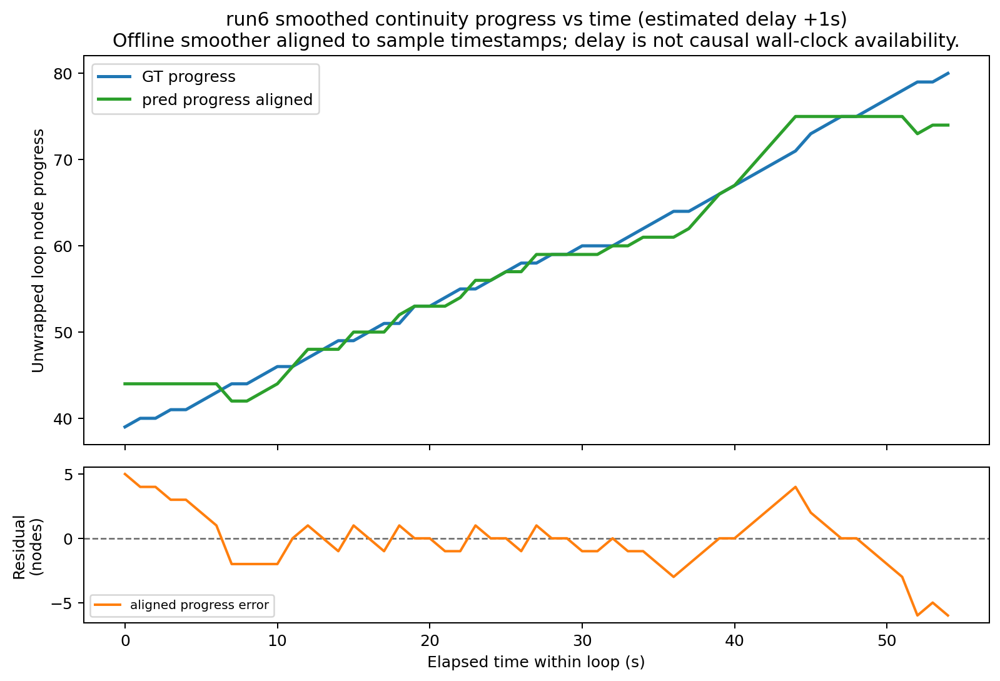

Fixedlag5 continuity:

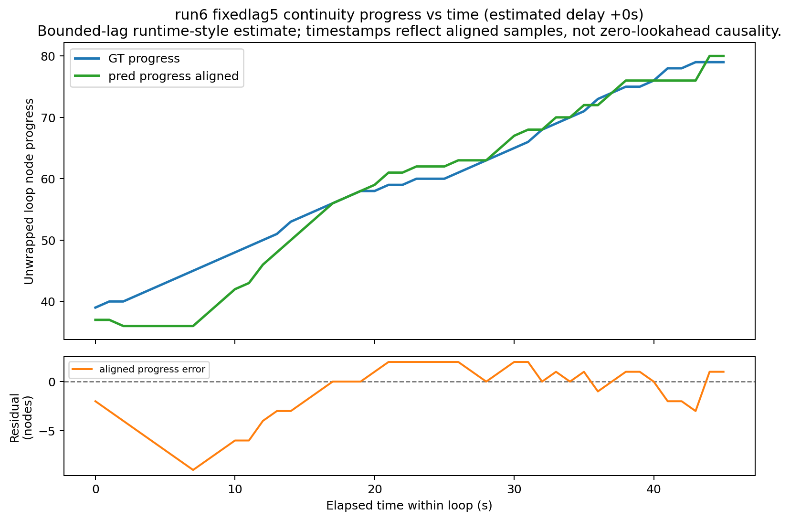

Interpretation:

- this is the hardest representative loop in the expanded report
- the continuity layer still suppresses large jump-backs, but the trace is noticeably looser and less faithful to the loop than `mustang` or `gle350`
- estimated lag is still small at about `+1 s`

### Run 7 (`cx30`)

Plots:

- [Run 7 smoothed clean XY](/home/kara4/demo/acies-os/docs/design/artifacts/ict_tracker_2026-04-13_balanced_eval/continuity_layer/run7_smoothed_continuity_clean_xy.png)
- [Run 7 smoothed timing](/home/kara4/demo/acies-os/docs/design/artifacts/ict_tracker_2026-04-13_balanced_eval/continuity_layer/run7_smoothed_continuity_timing.png)
- [Run 7 fixedlag5 clean XY](/home/kara4/demo/acies-os/docs/design/artifacts/ict_tracker_2026-04-13_balanced_eval/continuity_layer/run7_fixedlag5_continuity_clean_xy.png)
- [Run 7 fixedlag5 timing](/home/kara4/demo/acies-os/docs/design/artifacts/ict_tracker_2026-04-13_balanced_eval/continuity_layer/run7_fixedlag5_continuity_timing.png)

Smoothed continuity:

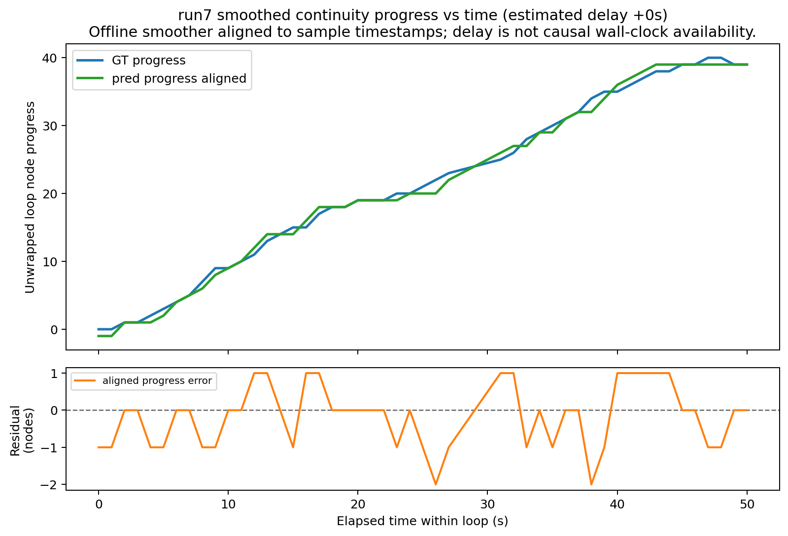

Fixedlag5 continuity:

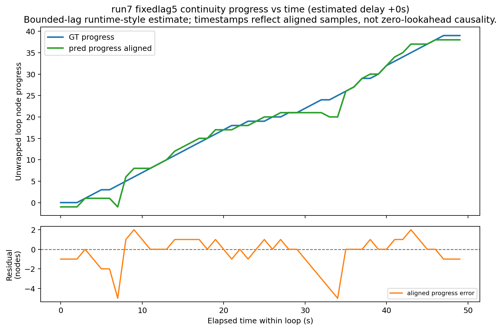

Interpretation:

- much better than `run6`
- continuity is credible and the representative loop is visually clean
- this suggests `cx30` is not uniformly bad, but it is less consistent than `mustang`

## Compact Loop Summary

From [`loop_comparison_summary.csv`](/home/kara4/demo/acies-os/docs/design/artifacts/ict_tracker_2026-04-13_balanced_eval/continuity_layer/loop_comparison_summary.csv):

| Run | Label | Smoothed Mean XY Error (m) | Runtime Mean XY Error (m) | Estimated Delay (s) |
| --- | --- | ---: | ---: | ---: |
| `0` | `mustang` | `8.07` | `8.16` | `0` |
| `1` | `mustang` | `9.31` | `9.39` | `0` |
| `2` | `miata` | `16.72` | `17.83` | `-1` |
| `3` | `miata` | `10.76` | `18.34` | `-1` |
| `4` | `gle350` | `9.35` | `10.10` | `0` |
| `5` | `gle350` | `9.15` | `9.15` | `0` |
| `6` | `cx30` | `18.63` | `25.23` | `1` |
| `7` | `cx30` | `7.41` | `13.15` | `0` |

What degrades on the broader set:

- `miata` and `cx30`, especially `run2` and `run6`, are clearly weaker than the original compact `mustang`/`gle350` view
- the degradation shows up more as looser path adherence and weaker loop-by-loop stability than as obvious large-delay behavior
- delay remains small on the selected representative loops; the broader-set concern is continuity quality, not timing lag

## Conclusion

The current tracker still looks acceptable on the broader multi-target set if the decision criterion is continuity and path coherence.

That said:

- the earlier compact report was optimistic because it only visualized the stronger `mustang` and `gle350` cases
- on a balanced multi-target view, `fixedlag5_smoothed_hybrid_mic` still preserves the key continuity gains over raw `hybrid_mic`
- the main weakness is reduced robustness on `miata` and `cx30`, where the trace is still coherent but less consistently faithful to the true loop

Practical read:

- keep `fixedlag5_smoothed_hybrid_mic` as the current runtime-oriented candidate
- use this `8`-run balanced subset, not the older hand-picked `4`-run compact set, for the next continuity-first comparisons
- if the next question is transfer robustness rather than just continuity, the evidence now points toward testing pooled templates against target-specific or held-out template variants
