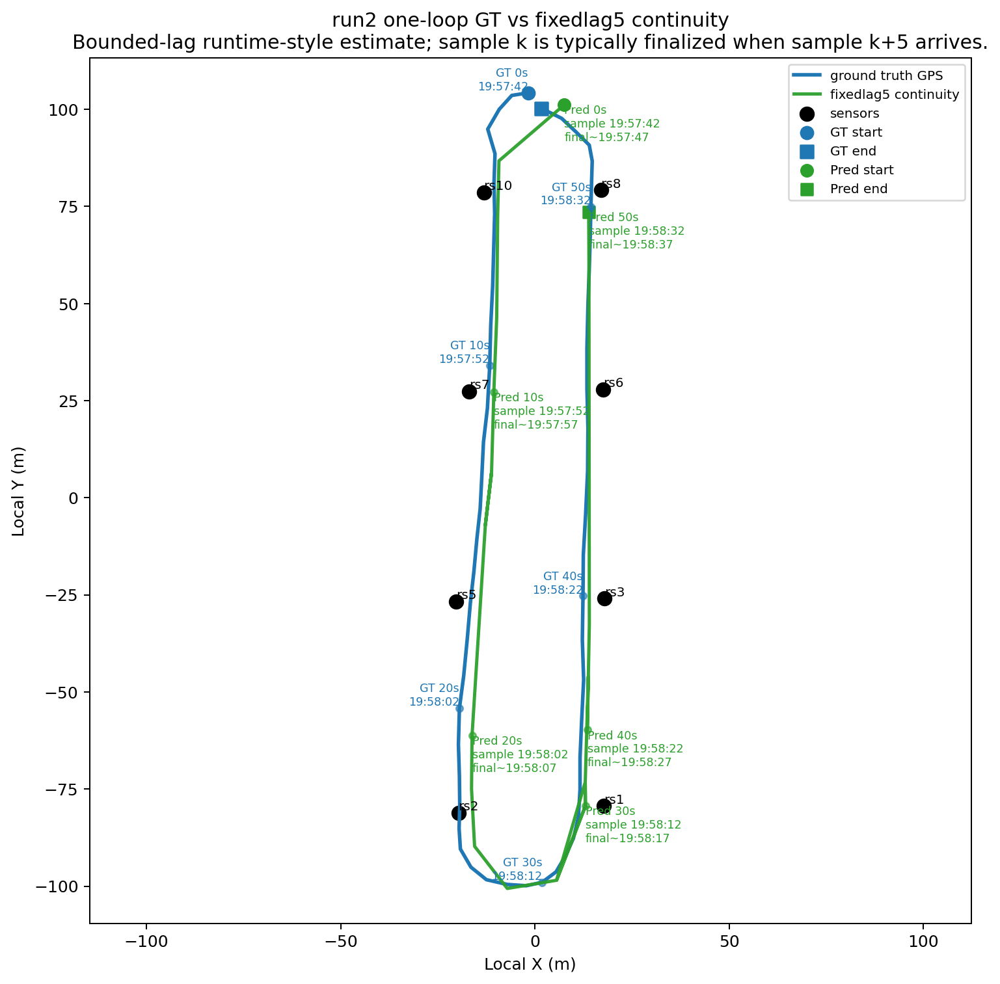
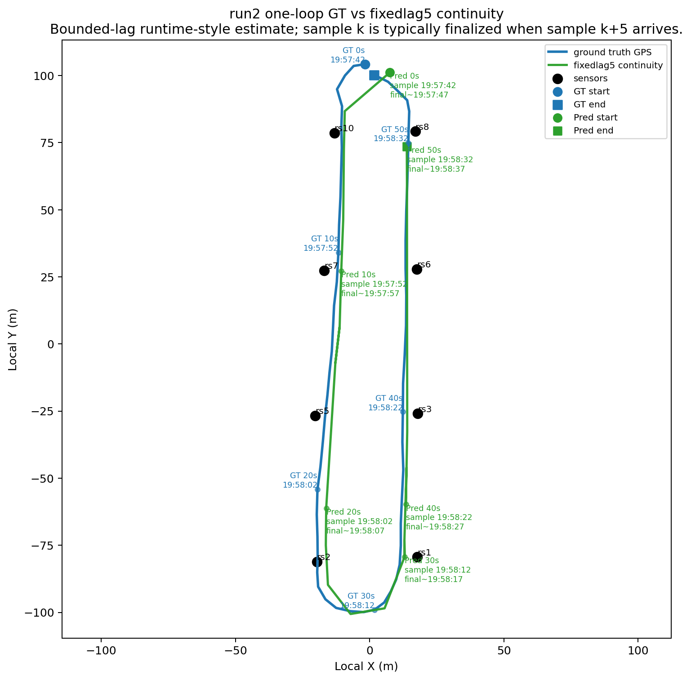
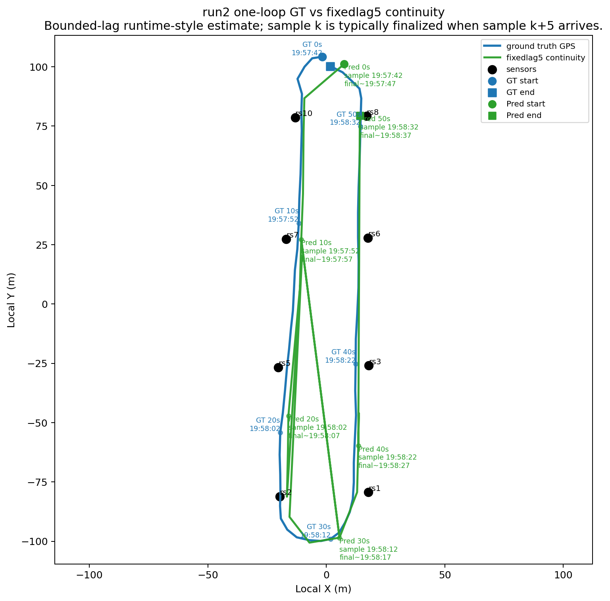
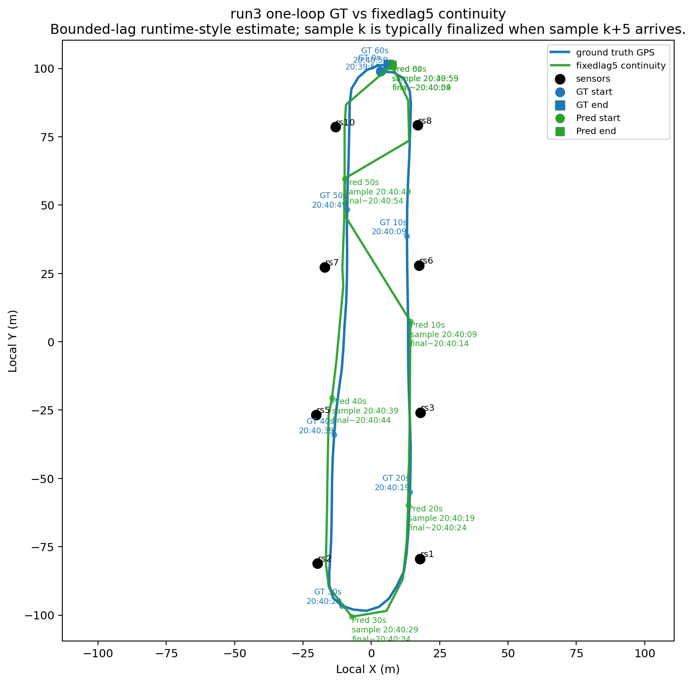
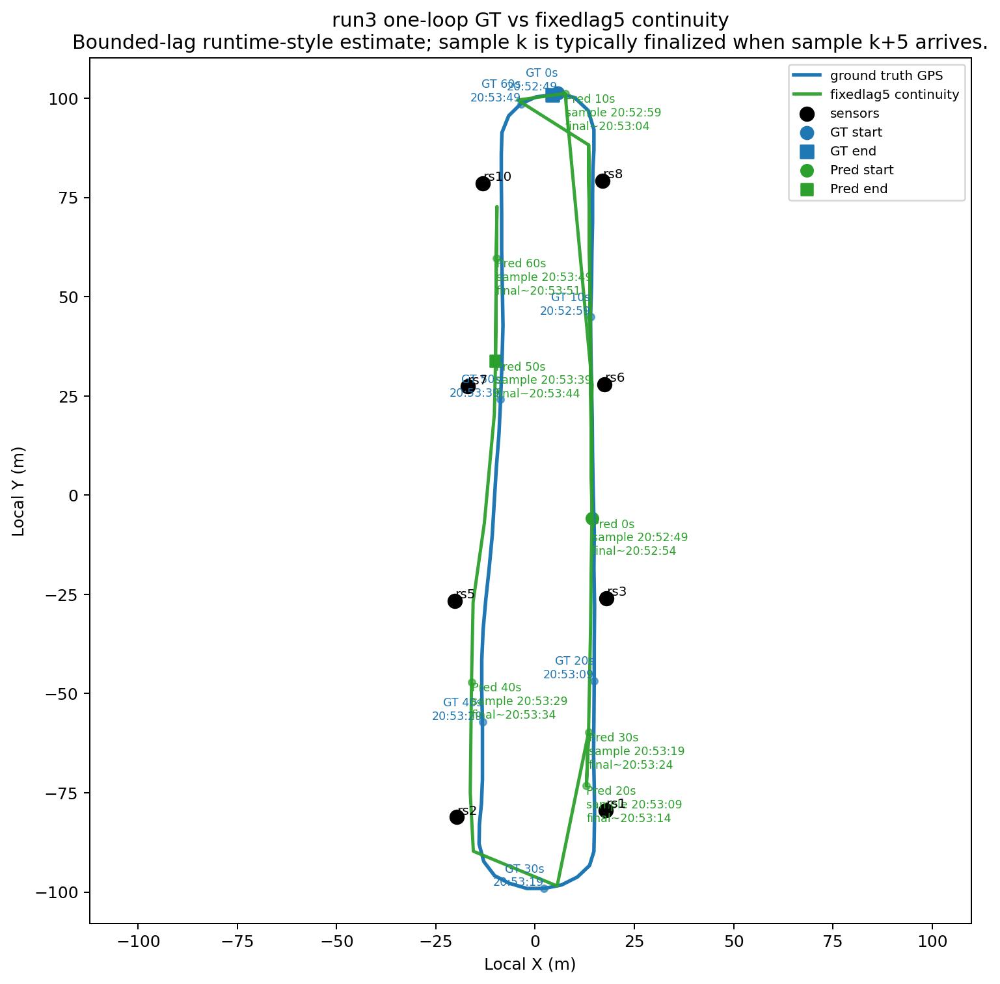
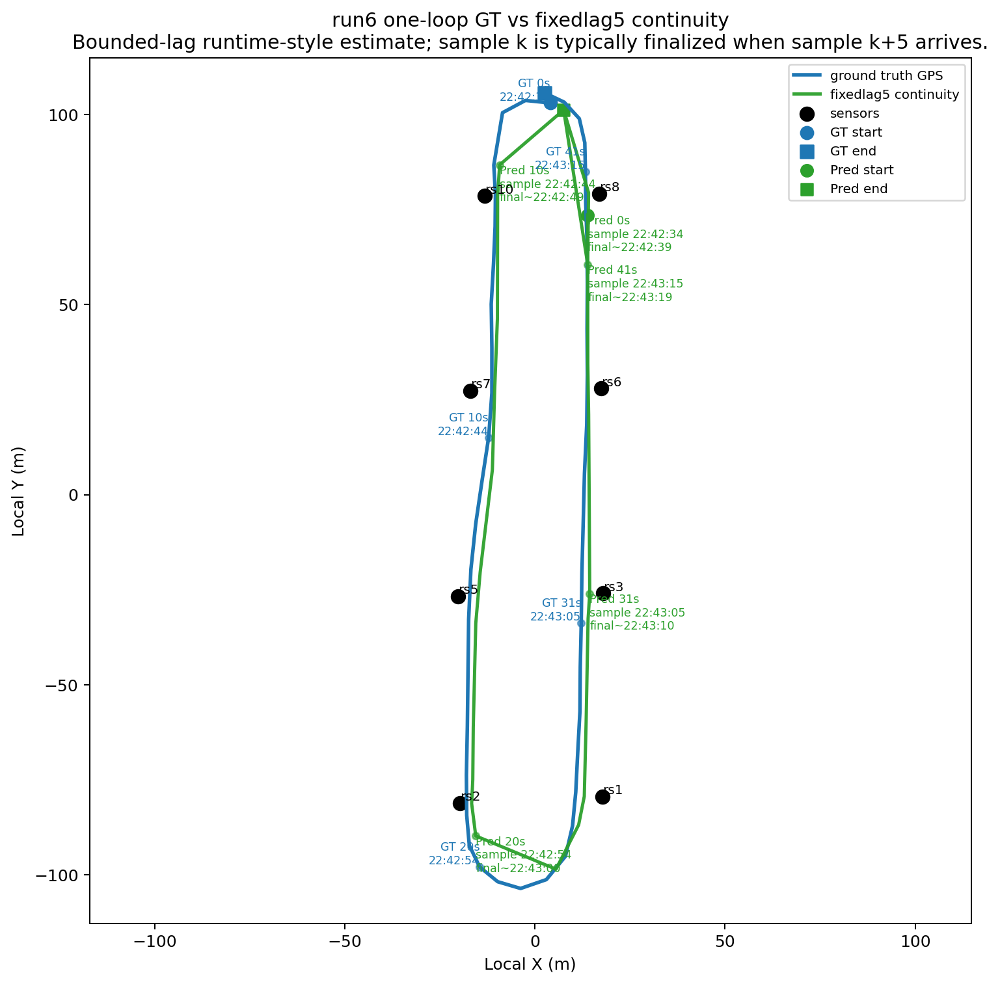
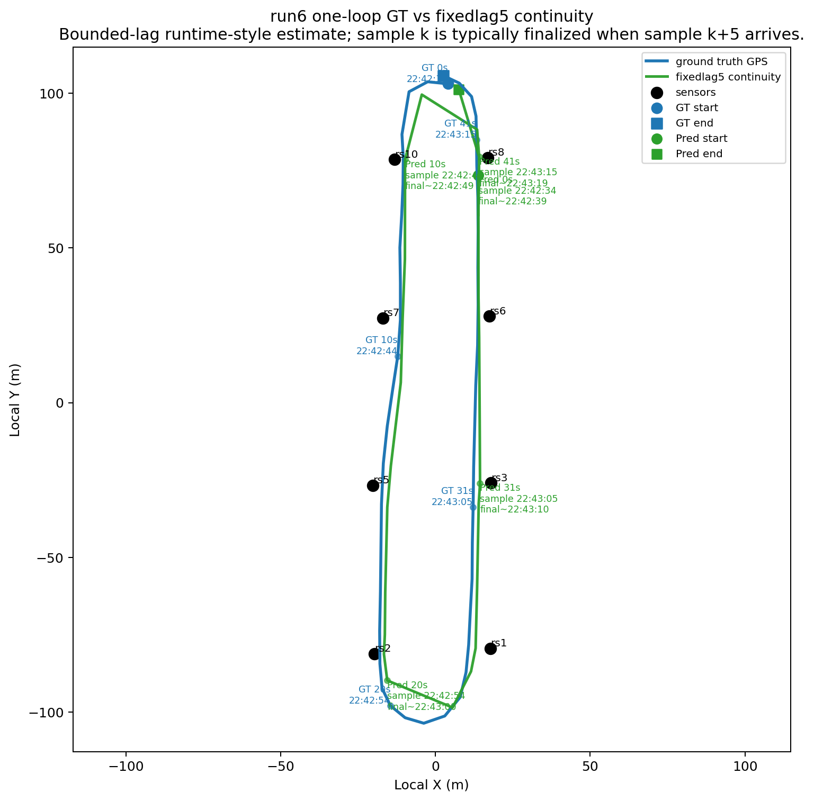
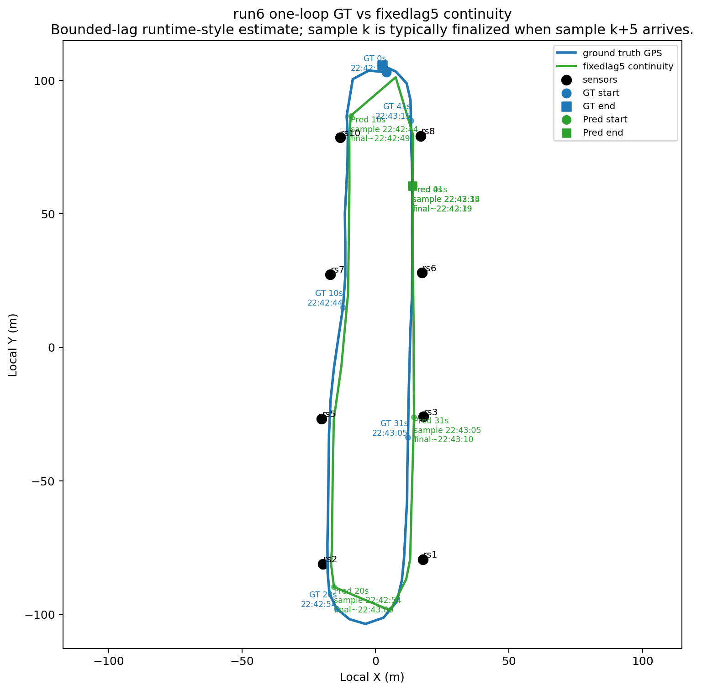
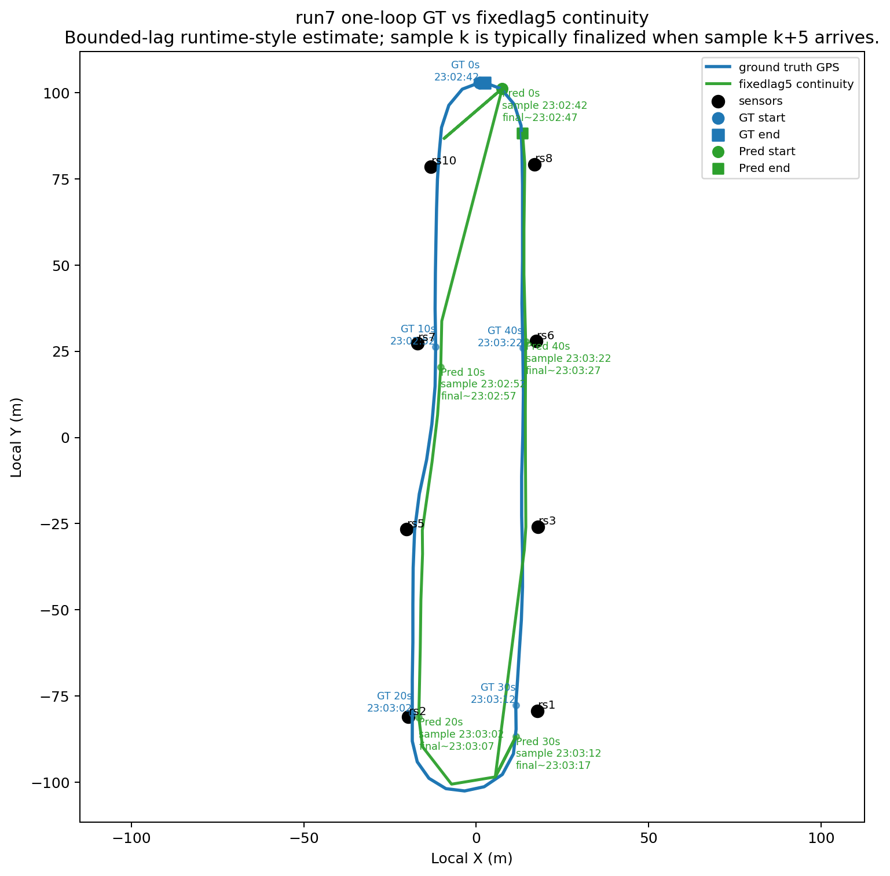
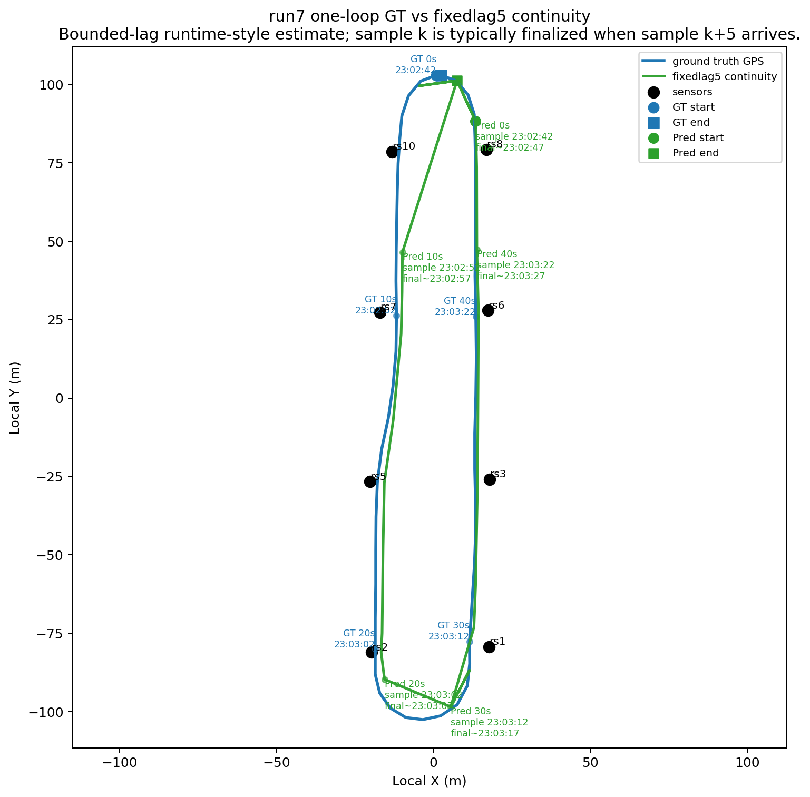

# ICT Template Scope Comparison

Date: `2026-04-13`

Report order note:

- this is a later same-day follow-up after the balanced-subset continuity report
- it tests whether the remaining `fixedlag5` jumpiness is mainly a pooled-template transfer problem

## Why This Report Exists

The balanced-subset continuity report showed that:

- `fixedlag5_smoothed_hybrid_mic` still looked good overall on all `8` ICT runs
- the weaker labels were `miata` and `cx30`
- some `fixedlag5` traces were still visibly jumpier on those harder runs

The next question was:

- is that jumpiness mainly because pooled templates transfer poorly across vehicle labels?

To answer that, this report compares three held-out training scopes while keeping the tracker and continuity algorithm fixed.

## Scope Definitions

Artifacts for this report live under:

- [`docs/design/artifacts/ict_tracker_2026-04-13_template_scope_eval`](/home/kara4/demo/acies-os/docs/design/artifacts/ict_tracker_2026-04-13_template_scope_eval)

Primary machine-readable outputs:

- [`template_scope_train_pairs.csv`](/home/kara4/demo/acies-os/docs/design/artifacts/ict_tracker_2026-04-13_template_scope_eval/template_scope_train_pairs.csv)
- [`continuity_scope_summary.csv`](/home/kara4/demo/acies-os/docs/design/artifacts/ict_tracker_2026-04-13_template_scope_eval/continuity_scope_summary.csv)
- [`fixedlag5_scope_per_run.csv`](/home/kara4/demo/acies-os/docs/design/artifacts/ict_tracker_2026-04-13_template_scope_eval/fixedlag5_scope_per_run.csv)
- [`fixedlag5_scope_by_label.csv`](/home/kara4/demo/acies-os/docs/design/artifacts/ict_tracker_2026-04-13_template_scope_eval/fixedlag5_scope_by_label.csv)

Training scopes:

- `pooled_loro`: current leave-one-run-out baseline, train on all other runs
- `cross_target_pooled`: train only on runs from other vehicle labels
- `target_specific_paired`: train only on the other run of the same label

Manifest row counts:

- `pooled_loro`: `56`
- `cross_target_pooled`: `48`
- `target_specific_paired`: `8`

Important evaluation choice:

- the main read below is `fixedlag5_smoothed_hybrid_mic`, because that is the runtime-oriented bounded-lag output
- `smoothed_hybrid_mic` is kept only as secondary context

## Aggregate `fixedlag5` Result

From [`continuity_scope_summary.csv`](/home/kara4/demo/acies-os/docs/design/artifacts/ict_tracker_2026-04-13_template_scope_eval/continuity_scope_summary.csv), filtered to `fixedlag5_smoothed_hybrid_mic`:

| Scope | Joint Station+Side Acc | Mean XY Error (m) | Mean Step (m) | P95 Step (m) |
| --- | ---: | ---: | ---: | ---: |
| `cross_target_pooled` | `0.421` | `47.68` | `10.68` | `28.54` |
| `pooled_loro` | `0.419` | `47.93` | `10.68` | `29.70` |
| `target_specific_paired` | `0.383` | `51.75` | `10.21` | `32.54` |

Immediate reading:

- `cross_target_pooled` is essentially tied with, and slightly better than, the current pooled leave-one-run-out baseline
- `target_specific_paired` is clearly worse overall
- that means the remaining jumpiness is not explained by a simple pooled-template transfer failure

Secondary offline context:

- `smoothed_hybrid_mic` follows the same pattern
- `target_specific_paired` also degrades in the offline smoother, not just in `fixedlag5`

## Label-Level `fixedlag5` Read

From [`fixedlag5_scope_by_label.csv`](/home/kara4/demo/acies-os/docs/design/artifacts/ict_tracker_2026-04-13_template_scope_eval/fixedlag5_scope_by_label.csv):

| Label | `cross_target_pooled` Mean XY | `pooled_loro` Mean XY | `target_specific_paired` Mean XY | Reading |
| --- | ---: | ---: | ---: | --- |
| `mustang` | `30.86` | `31.41` | `35.19` | pooled remains best |
| `miata` | `51.36` | `51.56` | `54.05` | target-specific gets worse |
| `gle350` | `47.04` | `46.90` | `49.29` | pooled remains best |
| `cx30` | `57.95` | `58.15` | `60.71` | target-specific gets worse overall |

Joint station+side accuracy tells the same story:

- `miata`: `0.367` cross-target, `0.368` pooled, `0.341` target-specific
- `cx30`: `0.348` cross-target, `0.353` pooled, `0.329` target-specific

Interpretation:

- the hard labels do not become more robust when we switch to one-run-per-target paired templates
- the larger pooled template bank appears to help more than it hurts
- the current weakness looks more like limited per-label data and observation ambiguity than a pooling mistake

## Per-Run `fixedlag5` Read

From [`fixedlag5_scope_per_run.csv`](/home/kara4/demo/acies-os/docs/design/artifacts/ict_tracker_2026-04-13_template_scope_eval/fixedlag5_scope_per_run.csv):

| Run | Label | Best scope by Mean XY | Key comparison |
| --- | --- | --- | --- |
| `0` | `mustang` | `cross_target_pooled` | `19.49` vs `20.46` pooled vs `23.46` target-specific |
| `1` | `mustang` | `cross_target_pooled` | pooled and cross-target nearly tied; target-specific worse |
| `2` | `miata` | `pooled_loro` | `53.55` pooled vs `53.56` cross-target vs `55.57` target-specific |
| `3` | `miata` | `cross_target_pooled` | `49.16` cross-target vs `49.57` pooled vs `52.54` target-specific |
| `4` | `gle350` | `pooled_loro` | pooled and cross-target nearly tied; target-specific slightly worse |
| `5` | `gle350` | `pooled_loro` | `49.68` pooled vs `49.73` cross-target vs `53.71` target-specific |
| `6` | `cx30` | `target_specific_paired` | one clear exception: `60.08` target-specific vs `62.71` pooled |
| `7` | `cx30` | `cross_target_pooled` | `52.92` cross-target vs `53.60` pooled vs `61.34` target-specific |

Important exception:

- `run6` is the only run where target-specific paired training gives a meaningful XY improvement
- but the paired model also makes `run7` much worse, so the label-level `cx30` average still degrades

## Runtime Trace Comparison

These are the most relevant caution runs for the runtime-style `fixedlag5` trace.

### Run 2 (`miata`)

Direct links:

- pooled: [XY](/home/kara4/demo/acies-os/docs/design/artifacts/ict_tracker_2026-04-13_template_scope_eval/pooled_loro/continuity_layer/run2_fixedlag5_continuity_clean_xy.png), [timing](/home/kara4/demo/acies-os/docs/design/artifacts/ict_tracker_2026-04-13_template_scope_eval/pooled_loro/continuity_layer/run2_fixedlag5_continuity_timing.png)
- cross-target: [XY](/home/kara4/demo/acies-os/docs/design/artifacts/ict_tracker_2026-04-13_template_scope_eval/cross_target_pooled/continuity_layer/run2_fixedlag5_continuity_clean_xy.png), [timing](/home/kara4/demo/acies-os/docs/design/artifacts/ict_tracker_2026-04-13_template_scope_eval/cross_target_pooled/continuity_layer/run2_fixedlag5_continuity_timing.png)
- target-specific: [XY](/home/kara4/demo/acies-os/docs/design/artifacts/ict_tracker_2026-04-13_template_scope_eval/target_specific_paired/continuity_layer/run2_fixedlag5_continuity_clean_xy.png), [timing](/home/kara4/demo/acies-os/docs/design/artifacts/ict_tracker_2026-04-13_template_scope_eval/target_specific_paired/continuity_layer/run2_fixedlag5_continuity_timing.png)

Reading:

- pooled and cross-target are effectively tied
- target-specific paired training does not reduce the jumpiness here

### Run 3 (`miata`)

Direct links:

- pooled: [XY](/home/kara4/demo/acies-os/docs/design/artifacts/ict_tracker_2026-04-13_template_scope_eval/pooled_loro/continuity_layer/run3_fixedlag5_continuity_clean_xy.png), [timing](/home/kara4/demo/acies-os/docs/design/artifacts/ict_tracker_2026-04-13_template_scope_eval/pooled_loro/continuity_layer/run3_fixedlag5_continuity_timing.png)
- cross-target: [XY](/home/kara4/demo/acies-os/docs/design/artifacts/ict_tracker_2026-04-13_template_scope_eval/cross_target_pooled/continuity_layer/run3_fixedlag5_continuity_clean_xy.png), [timing](/home/kara4/demo/acies-os/docs/design/artifacts/ict_tracker_2026-04-13_template_scope_eval/cross_target_pooled/continuity_layer/run3_fixedlag5_continuity_timing.png)
- target-specific: [XY](/home/kara4/demo/acies-os/docs/design/artifacts/ict_tracker_2026-04-13_template_scope_eval/target_specific_paired/continuity_layer/run3_fixedlag5_continuity_clean_xy.png), [timing](/home/kara4/demo/acies-os/docs/design/artifacts/ict_tracker_2026-04-13_template_scope_eval/target_specific_paired/continuity_layer/run3_fixedlag5_continuity_timing.png)

Reading:

- `run3` slightly favors cross-target pooled, not paired same-target templates
- again, that argues against “pooled templates are the main problem”

### Run 6 (`cx30`)

Direct links:

- pooled: [XY](/home/kara4/demo/acies-os/docs/design/artifacts/ict_tracker_2026-04-13_template_scope_eval/pooled_loro/continuity_layer/run6_fixedlag5_continuity_clean_xy.png), [timing](/home/kara4/demo/acies-os/docs/design/artifacts/ict_tracker_2026-04-13_template_scope_eval/pooled_loro/continuity_layer/run6_fixedlag5_continuity_timing.png)
- cross-target: [XY](/home/kara4/demo/acies-os/docs/design/artifacts/ict_tracker_2026-04-13_template_scope_eval/cross_target_pooled/continuity_layer/run6_fixedlag5_continuity_clean_xy.png), [timing](/home/kara4/demo/acies-os/docs/design/artifacts/ict_tracker_2026-04-13_template_scope_eval/cross_target_pooled/continuity_layer/run6_fixedlag5_continuity_timing.png)
- target-specific: [XY](/home/kara4/demo/acies-os/docs/design/artifacts/ict_tracker_2026-04-13_template_scope_eval/target_specific_paired/continuity_layer/run6_fixedlag5_continuity_clean_xy.png), [timing](/home/kara4/demo/acies-os/docs/design/artifacts/ict_tracker_2026-04-13_template_scope_eval/target_specific_paired/continuity_layer/run6_fixedlag5_continuity_timing.png)

Reading:

- `run6` is the one case where paired same-target templates help
- but the gain is local, not consistent enough to change the broader recommendation

### Run 7 (`cx30`)

Direct links:

- pooled: [XY](/home/kara4/demo/acies-os/docs/design/artifacts/ict_tracker_2026-04-13_template_scope_eval/pooled_loro/continuity_layer/run7_fixedlag5_continuity_clean_xy.png), [timing](/home/kara4/demo/acies-os/docs/design/artifacts/ict_tracker_2026-04-13_template_scope_eval/pooled_loro/continuity_layer/run7_fixedlag5_continuity_timing.png)
- cross-target: [XY](/home/kara4/demo/acies-os/docs/design/artifacts/ict_tracker_2026-04-13_template_scope_eval/cross_target_pooled/continuity_layer/run7_fixedlag5_continuity_clean_xy.png), [timing](/home/kara4/demo/acies-os/docs/design/artifacts/ict_tracker_2026-04-13_template_scope_eval/cross_target_pooled/continuity_layer/run7_fixedlag5_continuity_timing.png)
- target-specific: [XY](/home/kara4/demo/acies-os/docs/design/artifacts/ict_tracker_2026-04-13_template_scope_eval/target_specific_paired/continuity_layer/run7_fixedlag5_continuity_clean_xy.png), [timing](/home/kara4/demo/acies-os/docs/design/artifacts/ict_tracker_2026-04-13_template_scope_eval/target_specific_paired/continuity_layer/run7_fixedlag5_continuity_timing.png)

Reading:

- `run7` swings back the other way and clearly dislikes paired target-specific training
- this is why the label-level `cx30` average still favors pooled training

## Recommendation

Current recommendation:

- keep pooled templates as the default
- do not move to target-specific paired templates based on this result
- if anything, the surprising result is that cross-target pooled training is nearly as good as, and sometimes slightly better than, the current pooled baseline

What this means:

- the remaining `fixedlag5` jumpiness is not mainly caused by pooled-template transfer across labels
- the more likely issues are:
- limited data per label and per run
- observation ambiguity in the harder runs
- continuity-layer emission quality, not just template-pool composition

Next sensible evaluation step:

- keep `fixedlag5_smoothed_hybrid_mic` as the runtime-oriented baseline
- add stronger held-out evaluation or richer template estimation before redesigning the decoder
- if we want the next highest-signal experiment, compare the current pooled mean-template approach against a more robust observation model rather than switching immediately to target-specific pairing
