# ICT Baseline vs Pooled-Median Traces

Date: `2026-04-14`

## Purpose

This note directly compares the current `2026-04-13` balanced-eval baseline traces against the new pooled-median observation-model traces on the same caution runs.

The comparison is:

- old baseline: `2026-04-13` balanced-subset continuity output
- new candidate: `2026-04-14` pooled-median observation model

The goal is not to replace the held-out blocked-CV result. The goal is to make the visual delta easy to inspect on the exact runs where jumpiness mattered most.

Related notes:

- baseline continuity report: [`2026-04-13-ict-balanced-subset-continuity.md`](/home/kara4/demo/acies-os/docs/design/ict_tracker/2026-04-13-ict-balanced-subset-continuity.md)

Preview note:

- inline images below use standard relative paths from `docs/design/ict_tracker/` to `../artifacts/...`
- if your markdown preview still renders them poorly, use the direct links listed under each run

## Quick Read

Per-run `fixedlag5_smoothed_hybrid_mic` summary for the overlap runs:

| Run | Label | Old Joint Acc | New Joint Acc | Old Mean XY (m) | New Mean XY (m) | Reading |
| --- | --- | ---: | ---: | ---: | ---: | --- |
| `2` | `miata` | `0.339` | `0.370` | `53.55` | `52.84` | pooled median better |
| `3` | `miata` | `0.398` | `0.398` | `49.57` | `47.84` | pooled median better on XY |
| `6` | `cx30` | `0.327` | `0.298` | `62.71` | `64.60` | pooled median worse here |
| `7` | `cx30` | `0.380` | `0.388` | `53.60` | `52.68` | pooled median better |

Immediate reading:

- pooled median improves `3/4` of the key caution runs
- `run6` remains the main exception and is the strongest caution against overclaiming the gain
- that is still consistent with the held-out blocked-CV result: pooled median is the better default overall, but not a uniform win on every hard trace

## Run 2 (`miata`)

Direct links:

- old smoothed: [XY](/home/kara4/demo/acies-os/docs/design/artifacts/ict_tracker_2026-04-13_balanced_eval/continuity_layer/run2_smoothed_continuity_clean_xy.png), [timing](/home/kara4/demo/acies-os/docs/design/artifacts/ict_tracker_2026-04-13_balanced_eval/continuity_layer/run2_smoothed_continuity_timing.png)
- old fixedlag5: [XY](/home/kara4/demo/acies-os/docs/design/artifacts/ict_tracker_2026-04-13_balanced_eval/continuity_layer/run2_fixedlag5_continuity_clean_xy.png), [timing](/home/kara4/demo/acies-os/docs/design/artifacts/ict_tracker_2026-04-13_balanced_eval/continuity_layer/run2_fixedlag5_continuity_timing.png)
- new smoothed pooled median: [XY](/home/kara4/demo/acies-os/docs/design/artifacts/ict_tracker_2026-04-14_observation_model_eval/pooled_median/fullfit/run2_smoothed_continuity_clean_xy.png), [timing](/home/kara4/demo/acies-os/docs/design/artifacts/ict_tracker_2026-04-14_observation_model_eval/pooled_median/fullfit/run2_smoothed_continuity_timing.png)
- new fixedlag5 pooled median: [XY](/home/kara4/demo/acies-os/docs/design/artifacts/ict_tracker_2026-04-14_observation_model_eval/pooled_median/fullfit/run2_fixedlag5_continuity_clean_xy.png), [timing](/home/kara4/demo/acies-os/docs/design/artifacts/ict_tracker_2026-04-14_observation_model_eval/pooled_median/fullfit/run2_fixedlag5_continuity_timing.png)

Old smoothed:

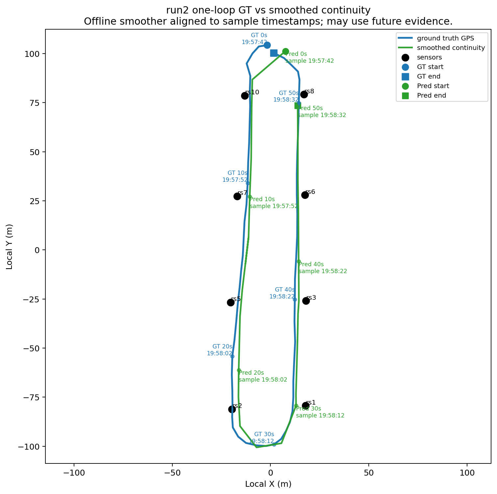

Old fixedlag5:

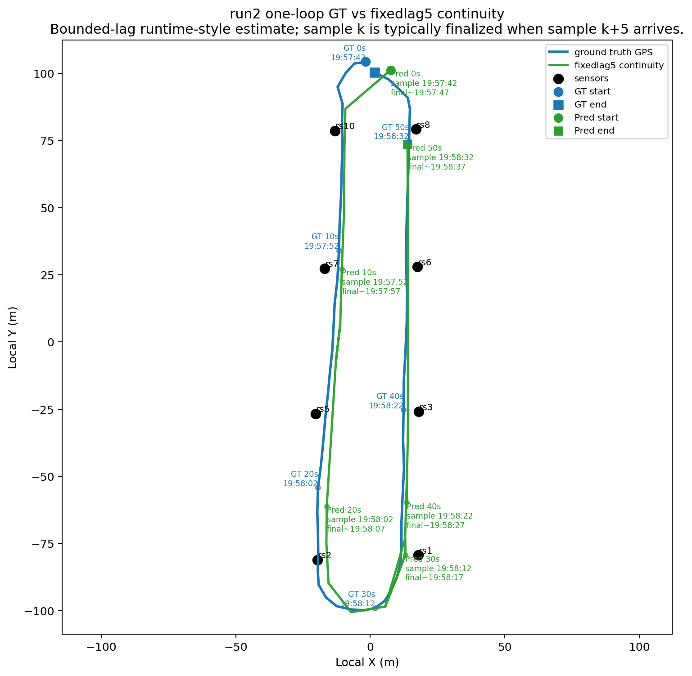

New smoothed pooled median:

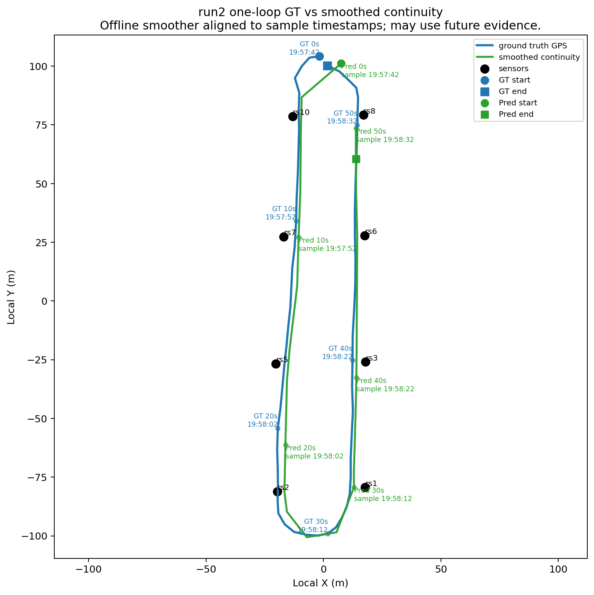

New fixedlag5 pooled median:

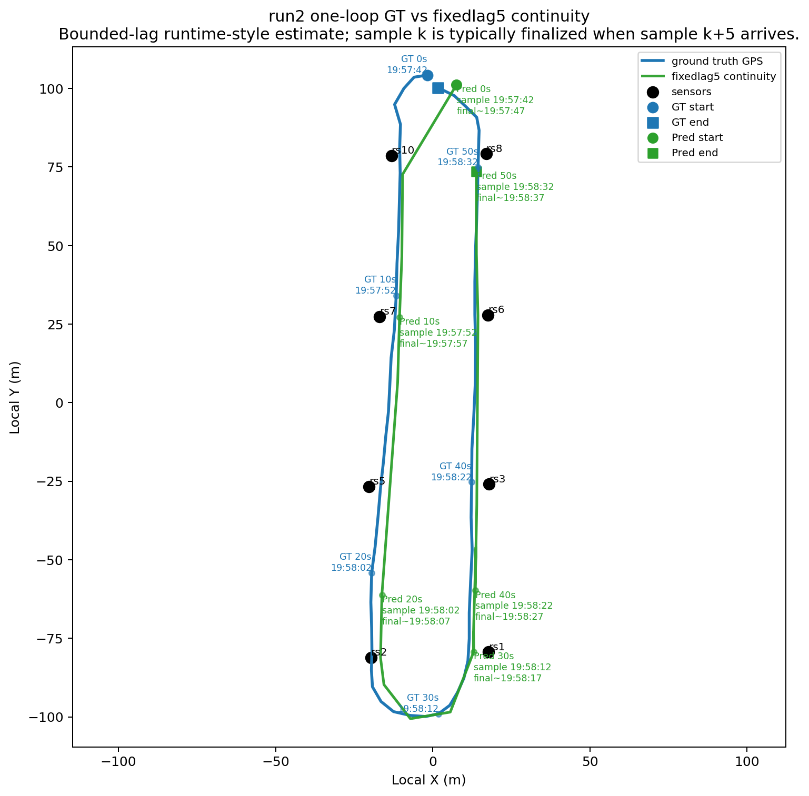

Reading:

- pooled median is visibly tighter than the old baseline
- the runtime trace still remains a hard case, but it is less loose than before

## Run 3 (`miata`)

Direct links:

- old smoothed: [XY](/home/kara4/demo/acies-os/docs/design/artifacts/ict_tracker_2026-04-13_balanced_eval/continuity_layer/run3_smoothed_continuity_clean_xy.png), [timing](/home/kara4/demo/acies-os/docs/design/artifacts/ict_tracker_2026-04-13_balanced_eval/continuity_layer/run3_smoothed_continuity_timing.png)
- old fixedlag5: [XY](/home/kara4/demo/acies-os/docs/design/artifacts/ict_tracker_2026-04-13_balanced_eval/continuity_layer/run3_fixedlag5_continuity_clean_xy.png), [timing](/home/kara4/demo/acies-os/docs/design/artifacts/ict_tracker_2026-04-13_balanced_eval/continuity_layer/run3_fixedlag5_continuity_timing.png)
- new smoothed pooled median: [XY](/home/kara4/demo/acies-os/docs/design/artifacts/ict_tracker_2026-04-14_observation_model_eval/pooled_median/fullfit/run3_smoothed_continuity_clean_xy.png), [timing](/home/kara4/demo/acies-os/docs/design/artifacts/ict_tracker_2026-04-14_observation_model_eval/pooled_median/fullfit/run3_smoothed_continuity_timing.png)
- new fixedlag5 pooled median: [XY](/home/kara4/demo/acies-os/docs/design/artifacts/ict_tracker_2026-04-14_observation_model_eval/pooled_median/fullfit/run3_fixedlag5_continuity_clean_xy.png), [timing](/home/kara4/demo/acies-os/docs/design/artifacts/ict_tracker_2026-04-14_observation_model_eval/pooled_median/fullfit/run3_fixedlag5_continuity_timing.png)

Old smoothed:

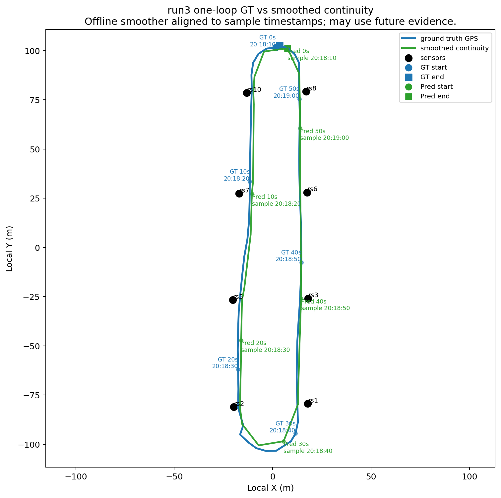

Old fixedlag5:

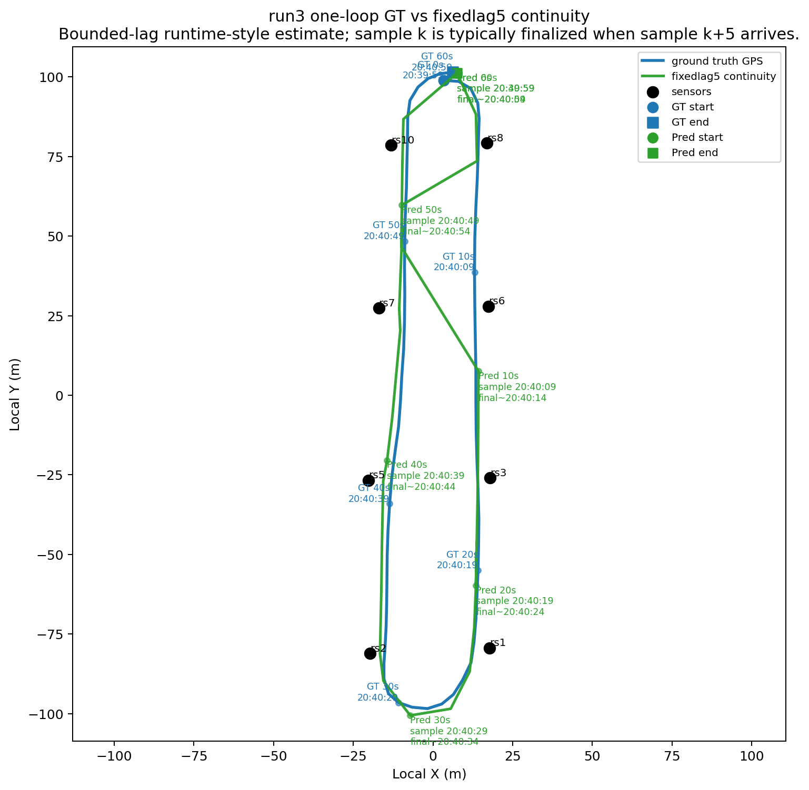

New smoothed pooled median:

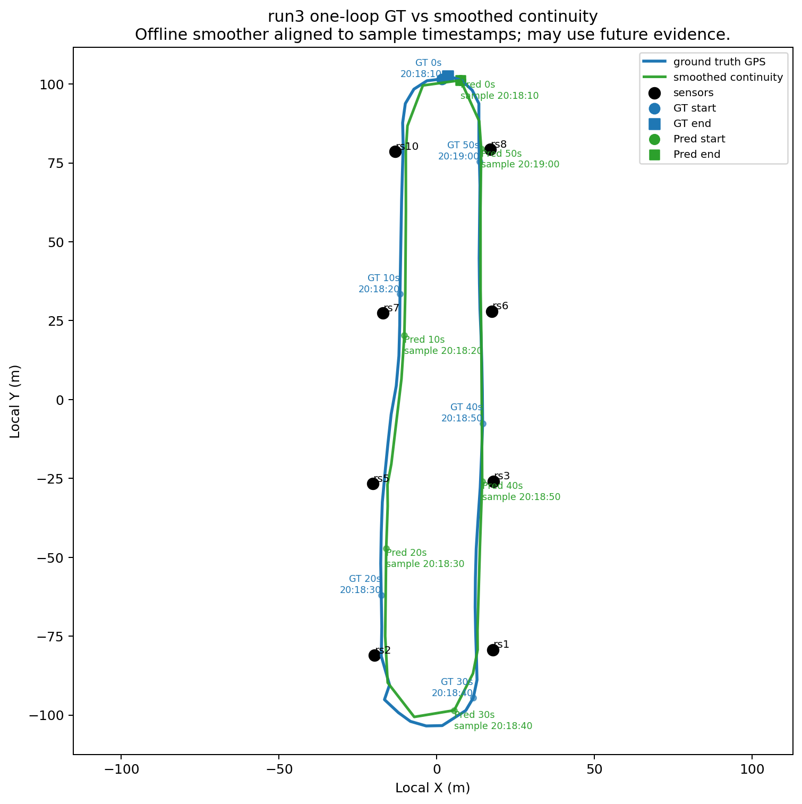

New fixedlag5 pooled median:

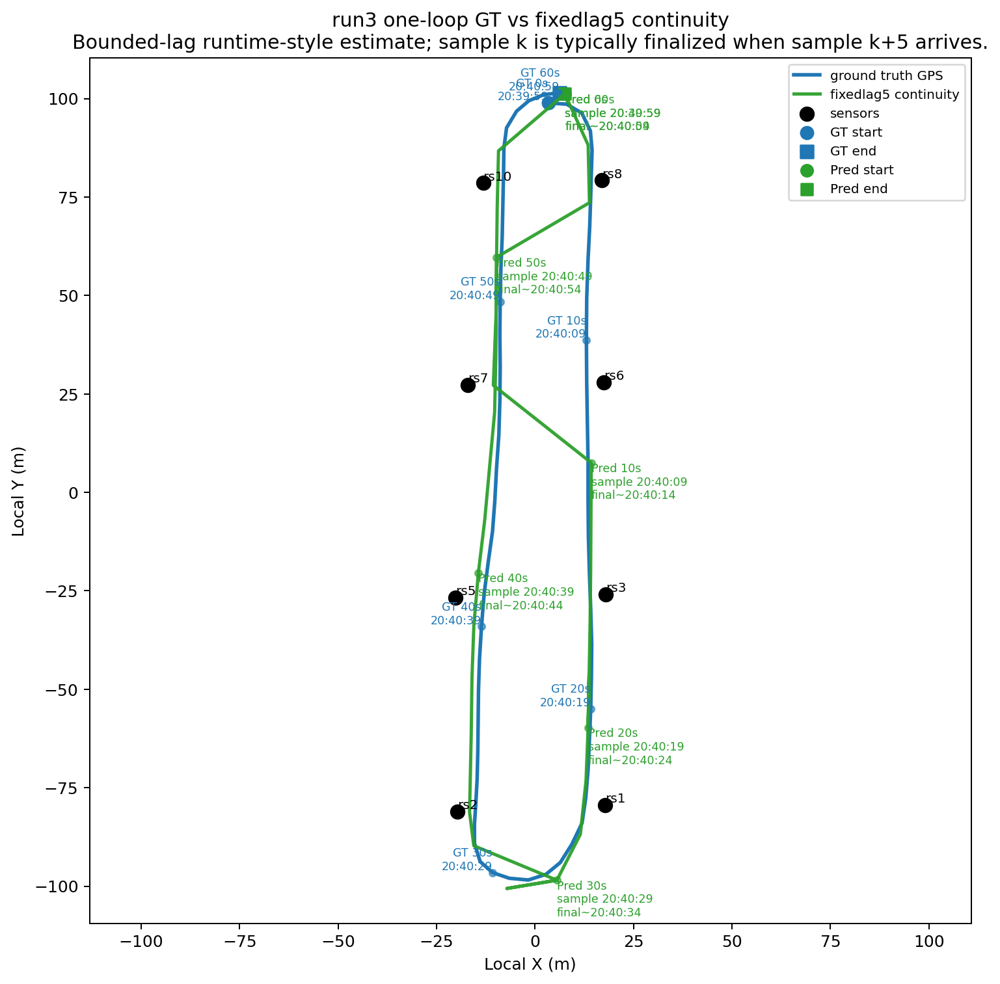

Reading:

- this is one of the clearest visual wins for pooled median
- the fixedlag5 trace looks tighter while preserving the same broad loop shape

## Run 6 (`cx30`)

Direct links:

- old smoothed: [XY](/home/kara4/demo/acies-os/docs/design/artifacts/ict_tracker_2026-04-13_balanced_eval/continuity_layer/run6_smoothed_continuity_clean_xy.png), [timing](/home/kara4/demo/acies-os/docs/design/artifacts/ict_tracker_2026-04-13_balanced_eval/continuity_layer/run6_smoothed_continuity_timing.png)
- old fixedlag5: [XY](/home/kara4/demo/acies-os/docs/design/artifacts/ict_tracker_2026-04-13_balanced_eval/continuity_layer/run6_fixedlag5_continuity_clean_xy.png), [timing](/home/kara4/demo/acies-os/docs/design/artifacts/ict_tracker_2026-04-13_balanced_eval/continuity_layer/run6_fixedlag5_continuity_timing.png)
- new smoothed pooled median: [XY](/home/kara4/demo/acies-os/docs/design/artifacts/ict_tracker_2026-04-14_observation_model_eval/pooled_median/fullfit/run6_smoothed_continuity_clean_xy.png), [timing](/home/kara4/demo/acies-os/docs/design/artifacts/ict_tracker_2026-04-14_observation_model_eval/pooled_median/fullfit/run6_smoothed_continuity_timing.png)
- new fixedlag5 pooled median: [XY](/home/kara4/demo/acies-os/docs/design/artifacts/ict_tracker_2026-04-14_observation_model_eval/pooled_median/fullfit/run6_fixedlag5_continuity_clean_xy.png), [timing](/home/kara4/demo/acies-os/docs/design/artifacts/ict_tracker_2026-04-14_observation_model_eval/pooled_median/fullfit/run6_fixedlag5_continuity_timing.png)

Old smoothed:

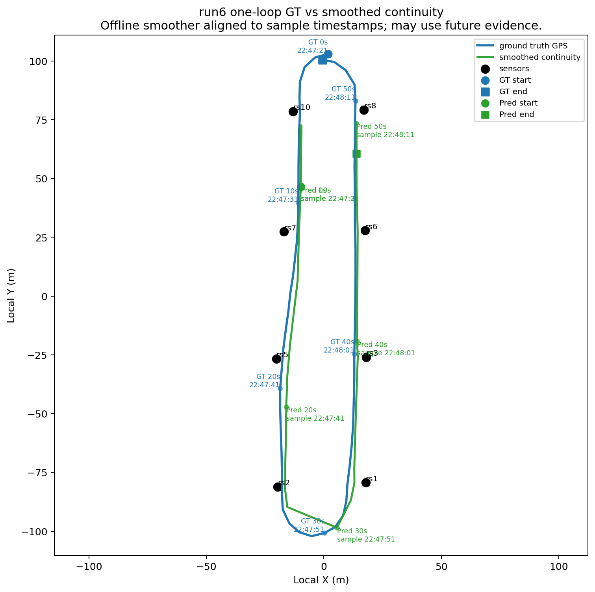

Old fixedlag5:

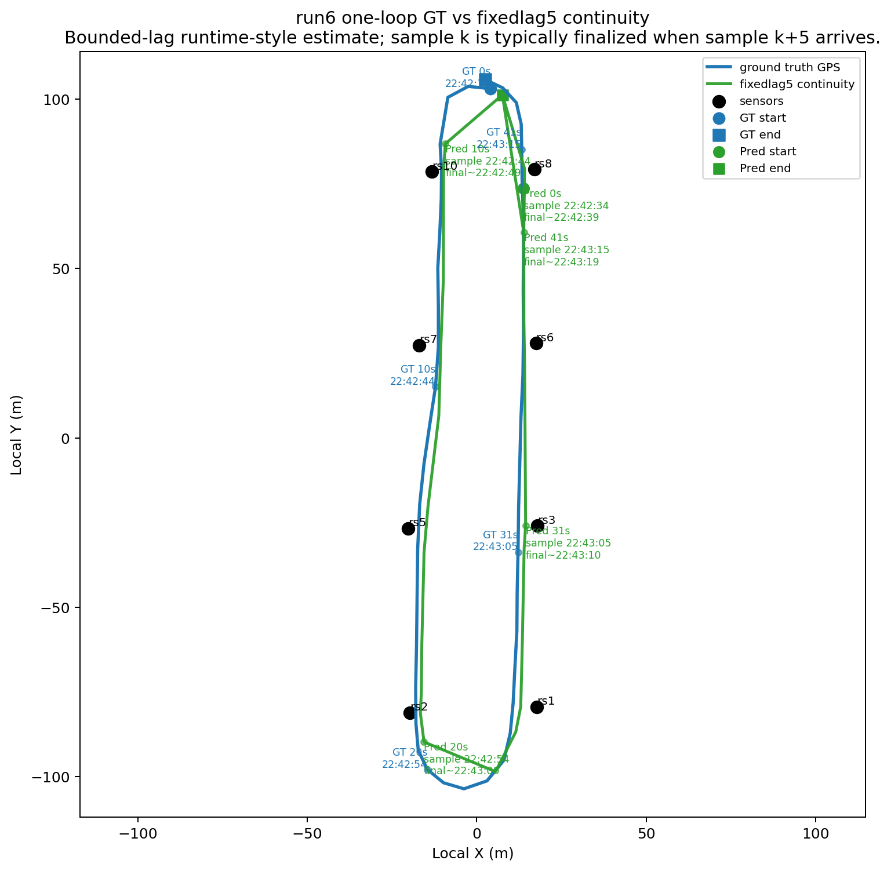

New smoothed pooled median:

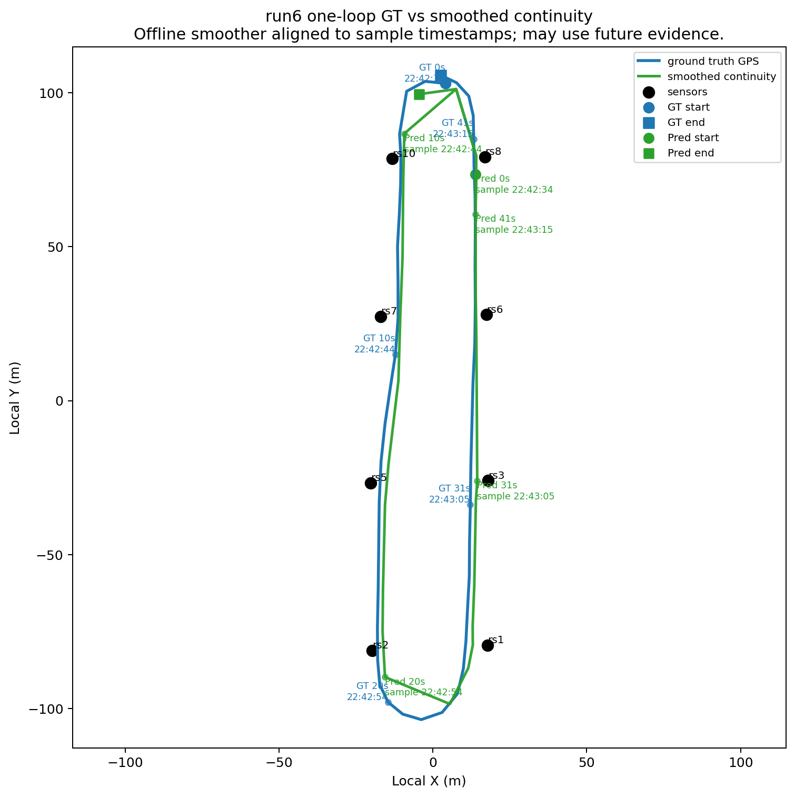

New fixedlag5 pooled median:

Reading:

- this is the main run where pooled median does not help
- the new trace is not cleaner than the old baseline here
- this run should remain the standing caution case

## Run 7 (`cx30`)

Direct links:

- old smoothed: [XY](/home/kara4/demo/acies-os/docs/design/artifacts/ict_tracker_2026-04-13_balanced_eval/continuity_layer/run7_smoothed_continuity_clean_xy.png), [timing](/home/kara4/demo/acies-os/docs/design/artifacts/ict_tracker_2026-04-13_balanced_eval/continuity_layer/run7_smoothed_continuity_timing.png)
- old fixedlag5: [XY](/home/kara4/demo/acies-os/docs/design/artifacts/ict_tracker_2026-04-13_balanced_eval/continuity_layer/run7_fixedlag5_continuity_clean_xy.png), [timing](/home/kara4/demo/acies-os/docs/design/artifacts/ict_tracker_2026-04-13_balanced_eval/continuity_layer/run7_fixedlag5_continuity_timing.png)
- new smoothed pooled median: [XY](/home/kara4/demo/acies-os/docs/design/artifacts/ict_tracker_2026-04-14_observation_model_eval/pooled_median/fullfit/run7_smoothed_continuity_clean_xy.png), [timing](/home/kara4/demo/acies-os/docs/design/artifacts/ict_tracker_2026-04-14_observation_model_eval/pooled_median/fullfit/run7_smoothed_continuity_timing.png)
- new fixedlag5 pooled median: [XY](/home/kara4/demo/acies-os/docs/design/artifacts/ict_tracker_2026-04-14_observation_model_eval/pooled_median/fullfit/run7_fixedlag5_continuity_clean_xy.png), [timing](/home/kara4/demo/acies-os/docs/design/artifacts/ict_tracker_2026-04-14_observation_model_eval/pooled_median/fullfit/run7_fixedlag5_continuity_timing.png)

Old smoothed:

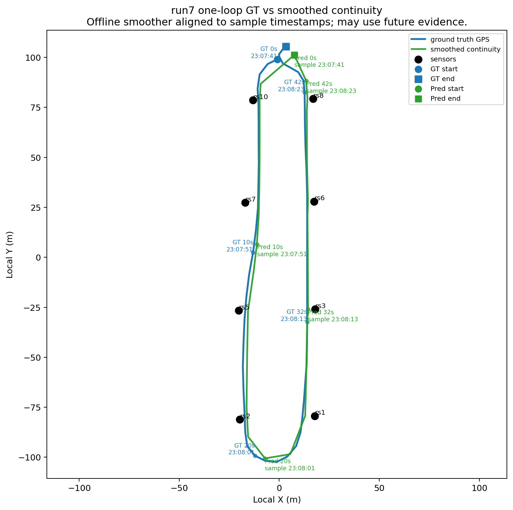

Old fixedlag5:

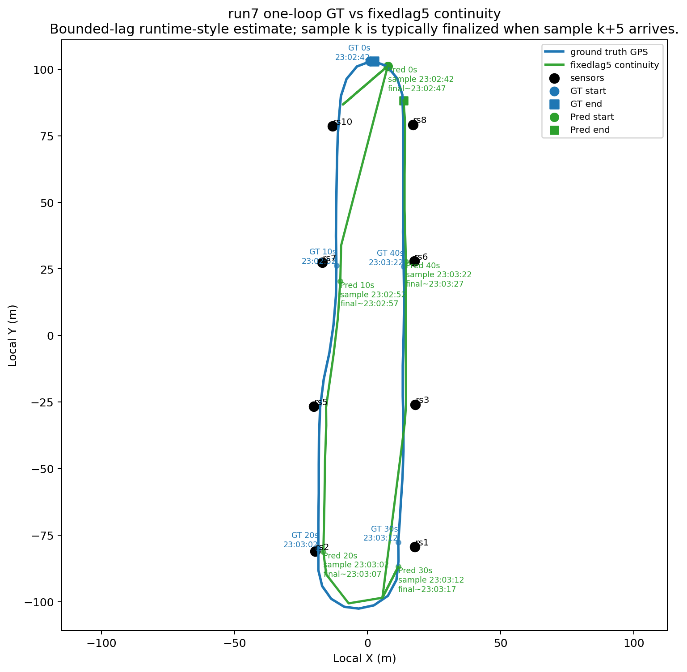

New smoothed pooled median:

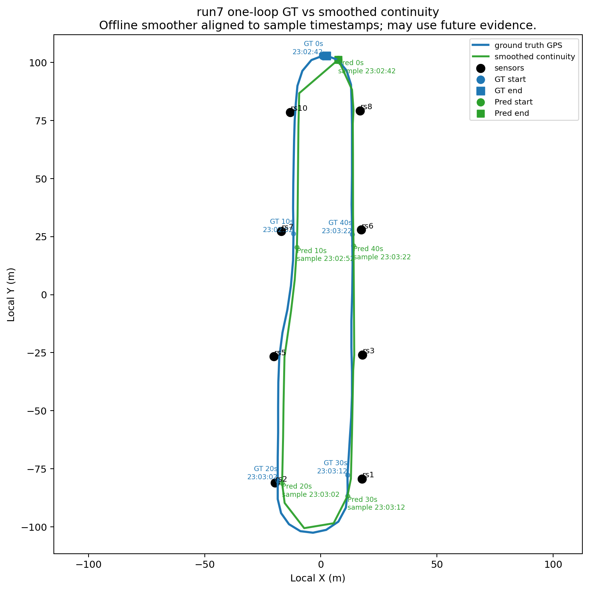

New fixedlag5 pooled median:

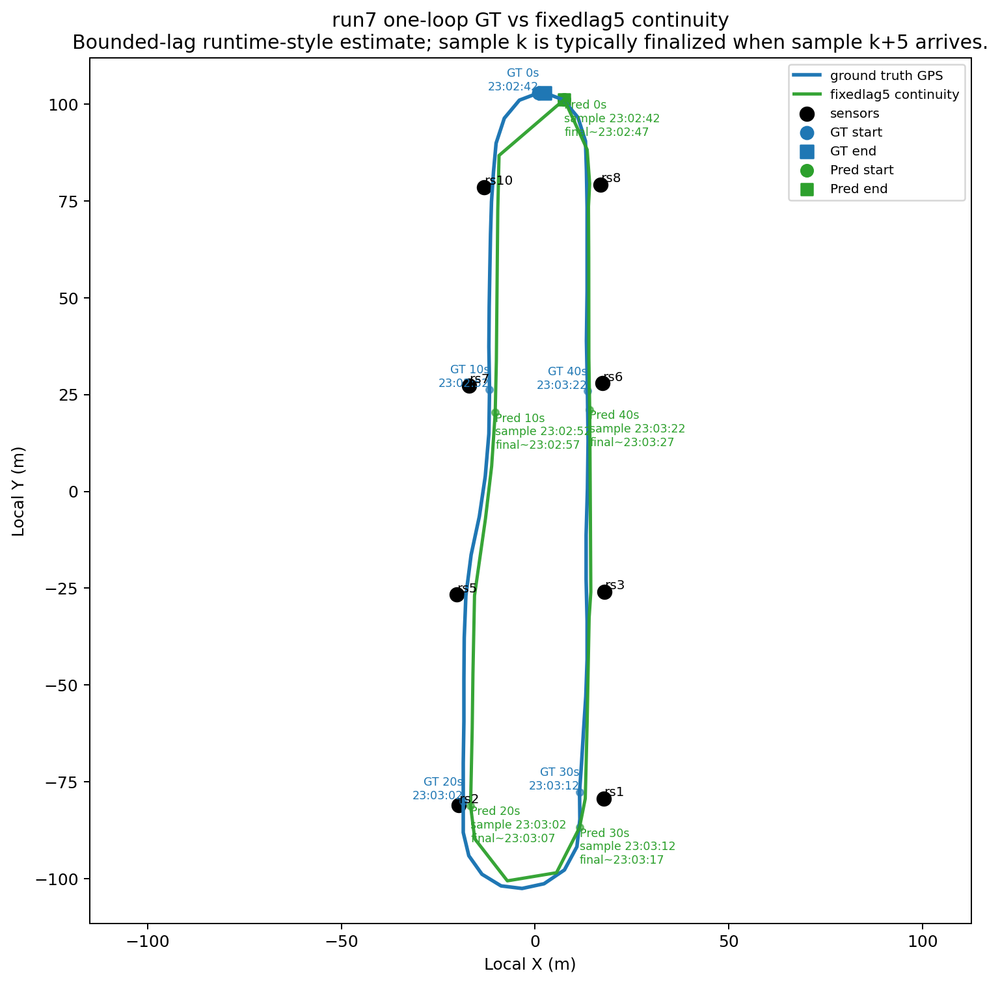

Reading:

- pooled median is a modest but real improvement here
- this run, together with `run2` and `run3`, is why the overall recommendation still favors pooled median

## Recommendation

Focused recommendation from the same-run trace comparison:

- yes, `pooled_median` is still the recommended replacement for the current pooled-mean observation model
- the visual evidence matches the held-out metrics on `run2`, `run3`, and `run7`
- `run6` remains the main non-win and should stay in the standard caution set whenever we review future variants
