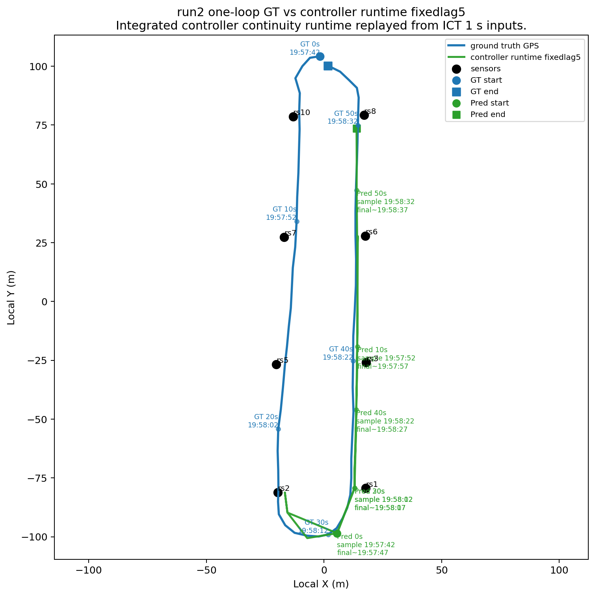
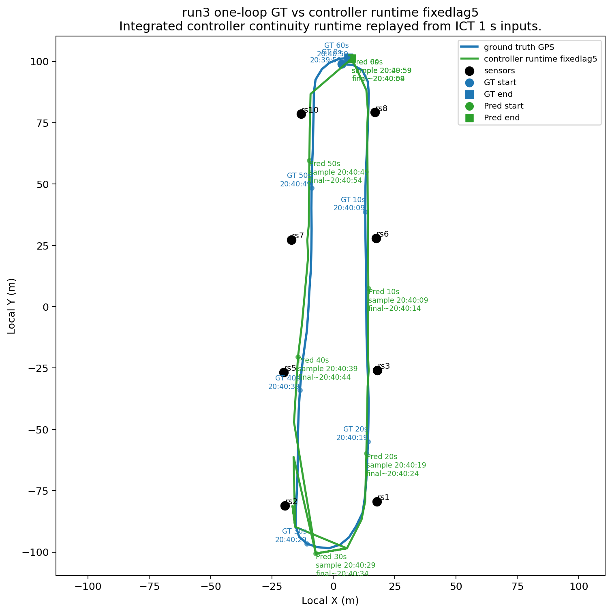
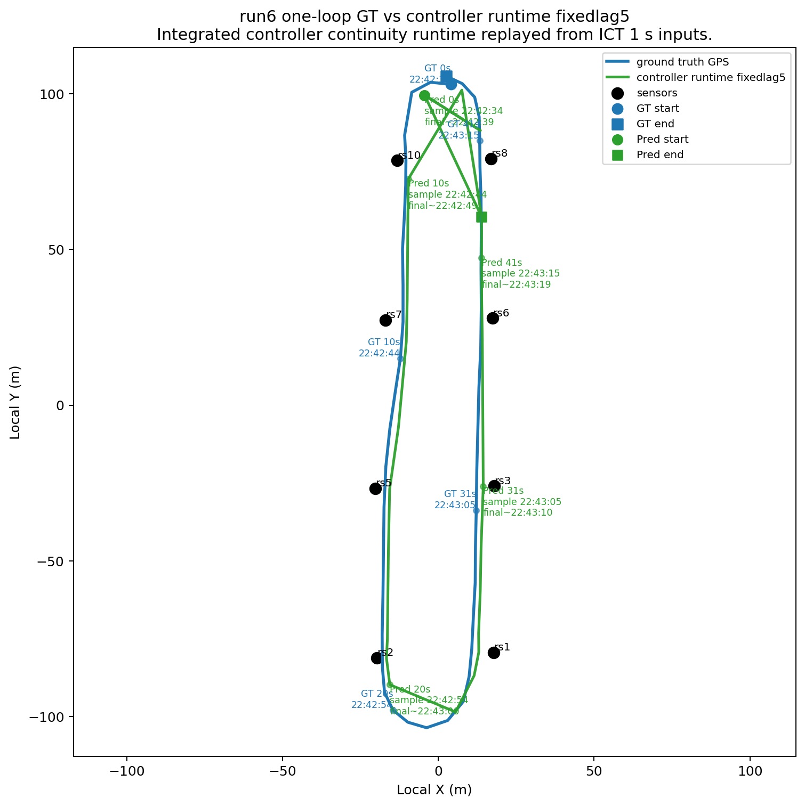
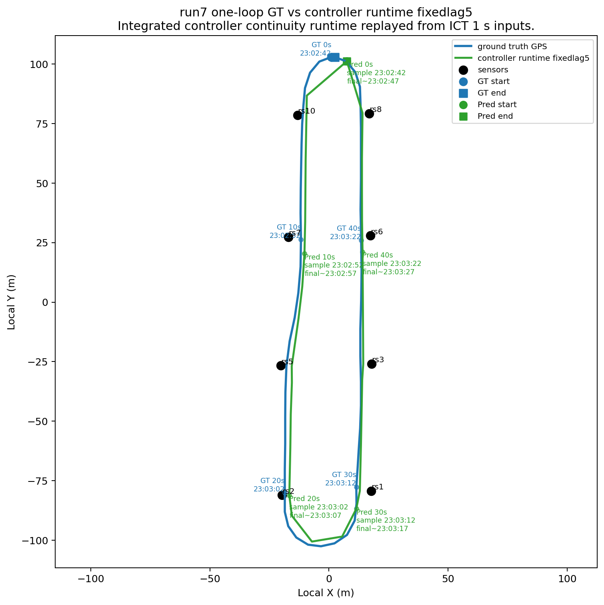
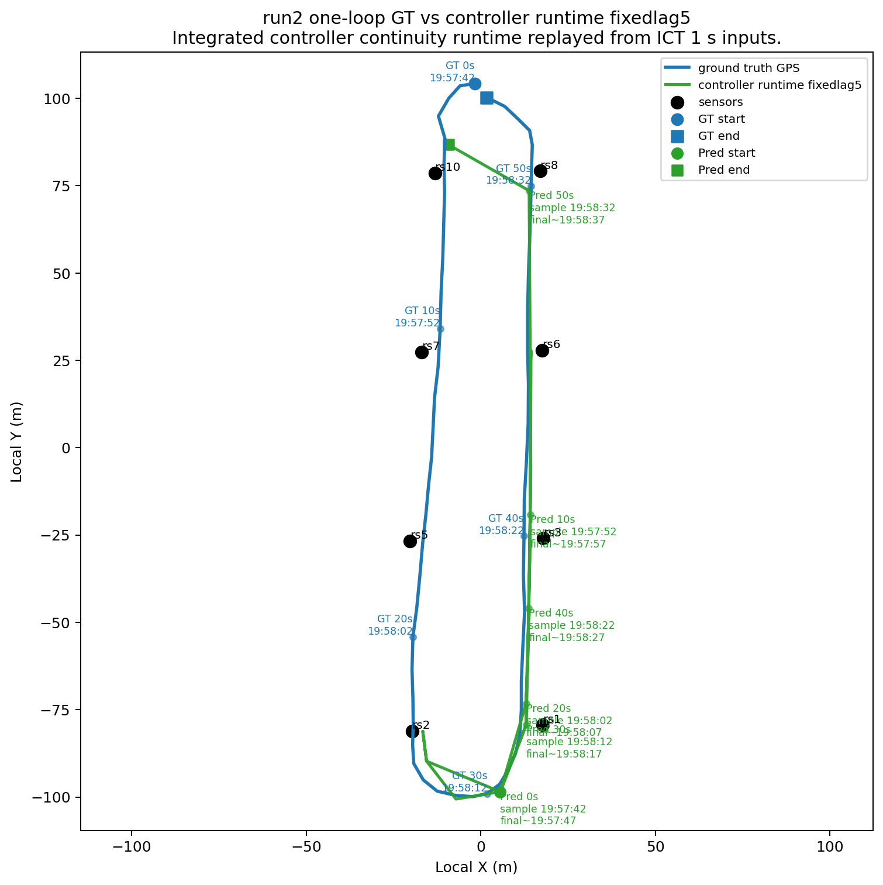
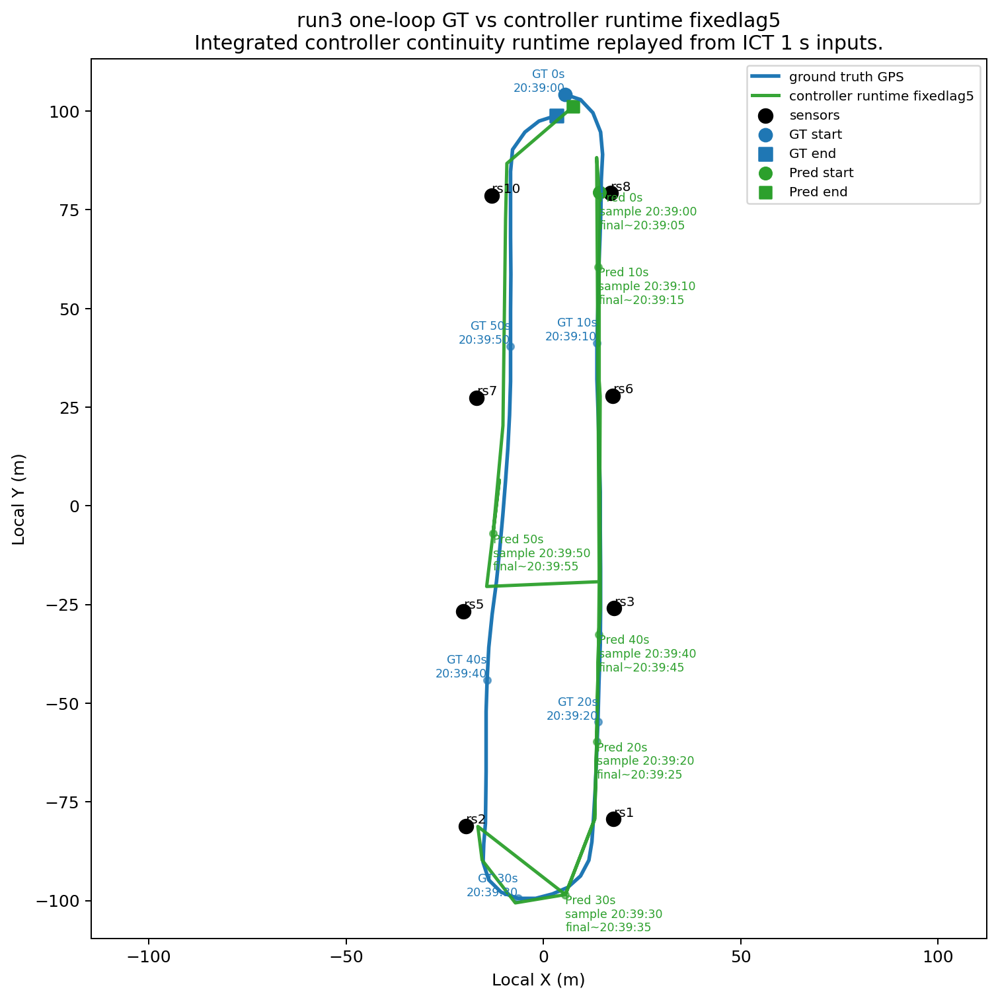
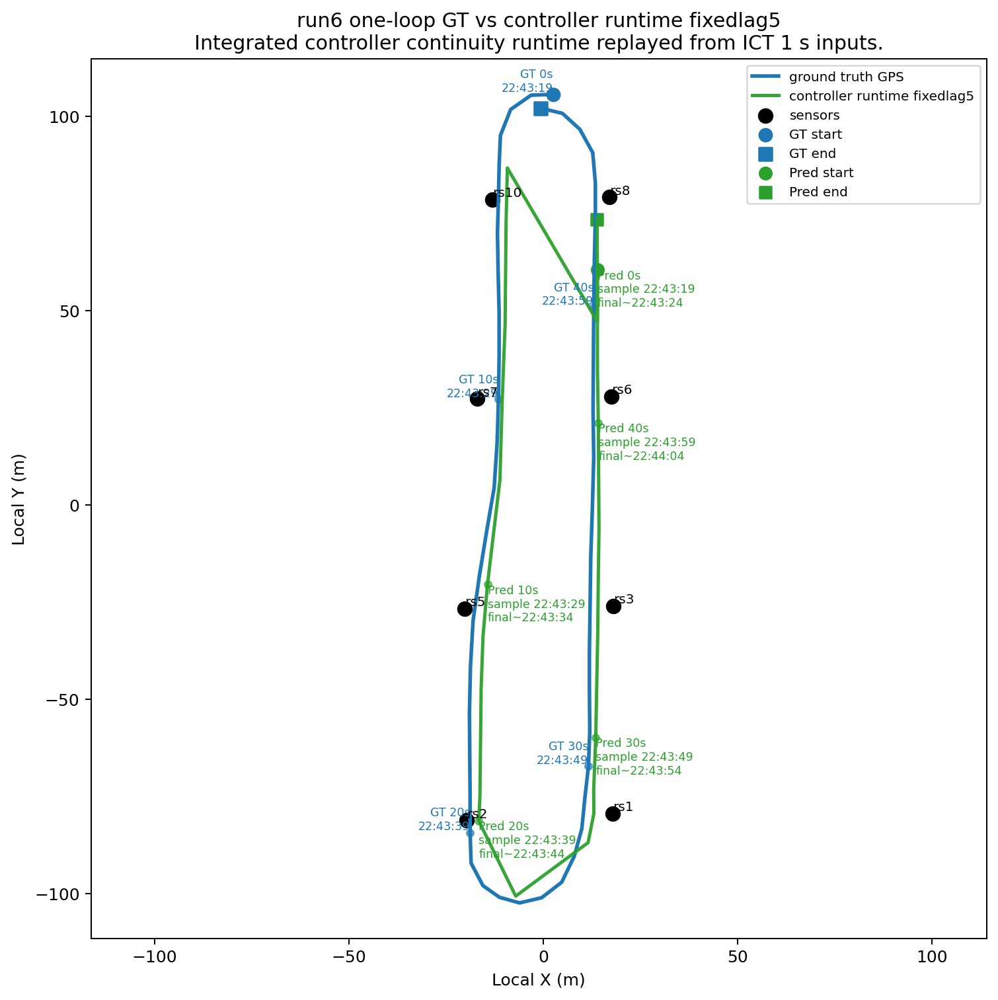
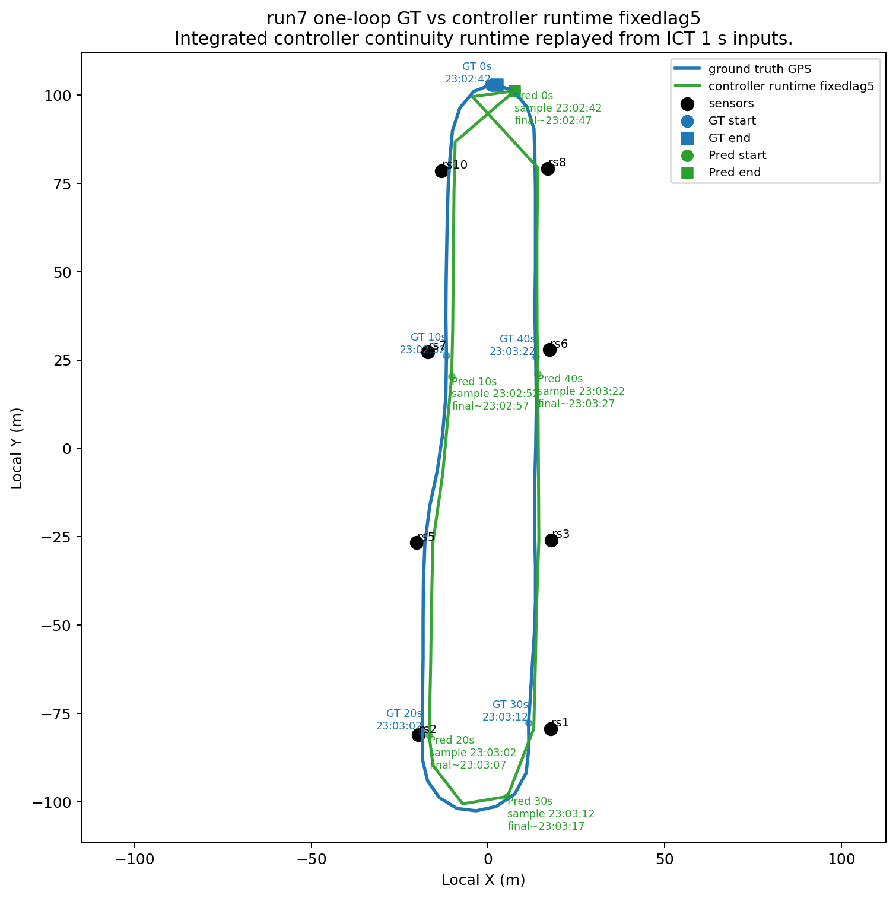

# ICT Controller Runtime Implementation

Date: `2026-04-14`

## Purpose

This note records the controller-side implementation of the current ICT continuity tracker, the replay-based verification path, and the practical deployment process for retuning the integration on a new map or sensor layout.

This implementation uses:

- the `pooled_median` observation model
- the `fixedlag5` bounded-lag continuity decoder
- the same `hybrid_mic` lower-layer structure carried over from the offline ICT work

It does **not** port the older pooled-mean baseline as the default runtime path.

## Main Code Changes

Primary runtime integration:

- [tracker.py](/home/kara4/demo/acies-os/packages/controllers/src/acies/controller/tracker.py)

New shared runtime module:

- [ict_tracker_runtime.py](/home/kara4/demo/acies-os/packages/controllers/src/acies/controller/ict_tracker_runtime.py)

New asset builder:

- [build_ict_tracker_assets.py](/home/kara4/demo/acies-os/packages/controllers/scripts/build_ict_tracker_assets.py)

New replay evaluation using the integrated runtime:

- [eval_tracker_runtime_replay.py](/home/kara4/demo/acies-os/packages/controllers/scripts/eval_tracker_runtime_replay.py)

New runtime unit test:

- [test_ict_tracker_runtime.py](/home/kara4/demo/acies-os/packages/controllers/tests/test_ict_tracker_runtime.py)

## Implementation Summary

The controller now supports two tracker modes:

- `tracker.mode = "particle_filter"`: the previous road-arc particle filter remains available
- `tracker.mode = "continuity_fixedlag"`: the new discrete ICT continuity runtime

The continuity runtime is asset-driven. `tracker.py` now loads a deployment asset bundle from `tracker.asset_dir` and runs:

1. per-second feature assembly from live `energy` updates
2. causal `hybrid_mic` prior estimation
3. pooled-median loop-node template scoring
4. fixed-lag continuity decoding
5. GPS publication from the committed lattice node

The controller GPS output shape stays the same:

- `{label: {lat, lon, elevation}, timestamp}`

### External I/O Compatibility

From the outside, the controller interface is intentionally kept stable between:

- the legacy particle-filter mode
- the new median-based continuity mode

What stays the same externally:

- same energy input topic family: `**/energy`
- same vehicle-label input topic: `**/vehicle`
- same primary output topic: `gps`
- same primary GPS payload shape: `{label: {lat, lon, elevation}, timestamp}`

So the intended deployment contract is:

- switching from particle filter to median-based continuity should not require downstream consumers to change how they subscribe to tracker output
- switching modes should not require upstream sensor replay/live publishers to change their topic structure

What changes is mainly internal tracker behavior:

- particle filter internals vs fixed-lag continuity internals
- continuous road interpolation vs discrete lattice-node output generation
- observation model implementation
- bounded-lag finalization behavior

The one important externally visible behavioral difference is timing semantics:

- the message format stays the same
- but continuity mode is a bounded-lag tracker, so a sample timestamp is usually finalized about `5 s` later in wall-clock processing

That is a behavior change, but not an input/output schema change.

The continuity mode also publishes a separate `tracker_debug` topic with:

- committed loop node
- station and side
- confidence
- reset flag
- sample timestamp
- finalize timestamp

## Asset Representation

Runtime assets now live as a small deployment bundle:

- [`metadata.json`](/home/kara4/demo/acies-os/docs/design/artifacts/ict_tracker_2026-04-14_runtime_integration/assets/metadata.json)
- [`sensor_geometry.csv`](/home/kara4/demo/acies-os/docs/design/artifacts/ict_tracker_2026-04-14_runtime_integration/assets/sensor_geometry.csv)
- [`lattice_points.csv`](/home/kara4/demo/acies-os/docs/design/artifacts/ict_tracker_2026-04-14_runtime_integration/assets/lattice_points.csv)
- [`feature_stats.csv`](/home/kara4/demo/acies-os/docs/design/artifacts/ict_tracker_2026-04-14_runtime_integration/assets/feature_stats.csv)
- [`station_side_templates.csv`](/home/kara4/demo/acies-os/docs/design/artifacts/ict_tracker_2026-04-14_runtime_integration/assets/station_side_templates.csv)
- [`continuity_templates.csv`](/home/kara4/demo/acies-os/docs/design/artifacts/ict_tracker_2026-04-14_runtime_integration/assets/continuity_templates.csv)

Important design point:

- the runtime code is no longer hard-wired to ICT loop geometry
- it consumes a generic discrete-state asset bundle
- moving to a different deployment means rebuilding the asset bundle, not rewriting the runtime decoder

### What `tracker.asset_dir` Means

`tracker.asset_dir` is the deployment-specific runtime bundle for the continuity tracker.

It is the place where we store the pieces that need to be re-estimated from data when the deployment changes, including:

- sensor geometry
- discrete path or lattice geometry
- feature normalization statistics
- station/side fallback templates
- pooled-median continuity templates
- decoder metadata and runtime settings

Operationally, this means:

- `tracker.py` stays the same
- `tracker.mode = "continuity_fixedlag"` stays the same
- when we have a new target mix or a new sensor deployment, we rebuild the asset bundle from the new calibration data
- then we update `tracker.asset_dir` to point to that new bundle

So `tracker.asset_dir` is the mechanism that lets us adapt the same integrated controller runtime to:

- new vehicle targets
- new sensor coordinates
- new map geometry
- future non-ICT deployments

without needing a tracker code rewrite each time.

## Why Median-Based FixedLag5

Yes, this implementation is the median-based `fixedlag5` tracker, not the mean-based one.

That follows the current recommendation from today’s design notes:

- [`2026-04-14-ict-fixedlag5-algorithm.md`](/home/kara4/demo/acies-os/docs/design/ict_tracker/2026-04-14-ict-fixedlag5-algorithm.md)
- [`2026-04-14-ict-baseline-vs-pooled-median-traces.md`](/home/kara4/demo/acies-os/docs/design/ict_tracker/2026-04-14-ict-baseline-vs-pooled-median-traces.md)

Current reading remains:

- pooled median is the better default overall
- it is not a uniform win on every run
- `run6` remains the main caution case

## Replay Evaluation Using The Integrated Runtime

Asset bundle for this implementation:

- [`assets/`](/home/kara4/demo/acies-os/docs/design/artifacts/ict_tracker_2026-04-14_runtime_integration/assets)

Controller-runtime replay outputs:

- [`runtime_eval/`](/home/kara4/demo/acies-os/docs/design/artifacts/ict_tracker_2026-04-14_runtime_integration/runtime_eval)
- [`runtime_eval_per_run_oracle/`](/home/kara4/demo/acies-os/docs/design/artifacts/ict_tracker_2026-04-14_runtime_integration/runtime_eval_per_run_oracle)

Production-style replay summary using deployment-global normalization stats from the asset bundle:

From [`runtime_summary.csv`](/home/kara4/demo/acies-os/docs/design/artifacts/ict_tracker_2026-04-14_runtime_integration/runtime_eval/runtime_summary.csv):

| Mode | Joint Station+Side Acc | Point Acc | Mean XY Error (m) | Mean Step (m) | P95 Step (m) |
| --- | ---: | ---: | ---: | ---: | ---: |
| `runtime_fixedlag5_global` | `0.423` | `0.158` | `45.98` | `10.57` | `32.94` |

Replay-only parity comparison using per-run oracle normalization:

From [`runtime_summary.csv`](/home/kara4/demo/acies-os/docs/design/artifacts/ict_tracker_2026-04-14_runtime_integration/runtime_eval_per_run_oracle/runtime_summary.csv):

| Mode | Joint Station+Side Acc | Point Acc | Mean XY Error (m) | Mean Step (m) | P95 Step (m) |
| --- | ---: | ---: | ---: | ---: | ---: |
| `runtime_fixedlag5_per_run_oracle` | `0.438` | `0.163` | `45.19` | `10.88` | `32.94` |

Reading:

- the integrated controller runtime replay is in the same performance range as the offline continuity work
- using deployment-global stats already works well
- replay-only oracle normalization helps a bit, but not dramatically
- that means the controller-side version does not depend on the unrealistic per-run normalization trick to be usable

## Per-Run Replay Read

From [`runtime_per_run_summary.csv`](/home/kara4/demo/acies-os/docs/design/artifacts/ict_tracker_2026-04-14_runtime_integration/runtime_eval/runtime_per_run_summary.csv):

| Run | Label | Joint Acc | Mean XY Error (m) | Mean Step (m) |
| --- | --- | ---: | ---: | ---: |
| `0` | `mustang` | `0.613` | `24.82` | `11.50` |
| `1` | `mustang` | `0.472` | `39.79` | `10.32` |
| `2` | `miata` | `0.274` | `68.65` | `10.26` |
| `3` | `miata` | `0.412` | `45.31` | `11.69` |
| `4` | `gle350` | `0.395` | `47.47` | `9.56` |
| `5` | `gle350` | `0.441` | `43.58` | `11.15` |
| `6` | `cx30` | `0.330` | `60.40` | `9.38` |
| `7` | `cx30` | `0.394` | `49.61` | `9.57` |

This keeps the same broad story as the offline notes:

- `mustang` is still strongest
- `miata` and `cx30` are still the main caution labels
- the runtime trace remains geometrically coherent even on the weaker runs

## Controller Runtime Trace Plots

These are generated from the integrated controller continuity runtime replay, not from the older offline-only decoder path.

One loop per run was generated for the caution set:

### Run 2 (`miata`)

- [XY trace](/home/kara4/demo/acies-os/docs/design/artifacts/ict_tracker_2026-04-14_runtime_integration/runtime_eval/run2_controller_runtime_clean_xy.png)
- [Timing / progress](/home/kara4/demo/acies-os/docs/design/artifacts/ict_tracker_2026-04-14_runtime_integration/runtime_eval/run2_controller_runtime_timing.png)

### Run 3 (`miata`)

- [XY trace](/home/kara4/demo/acies-os/docs/design/artifacts/ict_tracker_2026-04-14_runtime_integration/runtime_eval/run3_controller_runtime_clean_xy.png)
- [Timing / progress](/home/kara4/demo/acies-os/docs/design/artifacts/ict_tracker_2026-04-14_runtime_integration/runtime_eval/run3_controller_runtime_timing.png)

### Run 6 (`cx30`)

- [XY trace](/home/kara4/demo/acies-os/docs/design/artifacts/ict_tracker_2026-04-14_runtime_integration/runtime_eval/run6_controller_runtime_clean_xy.png)
- [Timing / progress](/home/kara4/demo/acies-os/docs/design/artifacts/ict_tracker_2026-04-14_runtime_integration/runtime_eval/run6_controller_runtime_timing.png)

### Run 7 (`cx30`)

- [XY trace](/home/kara4/demo/acies-os/docs/design/artifacts/ict_tracker_2026-04-14_runtime_integration/runtime_eval/run7_controller_runtime_clean_xy.png)
- [Timing / progress](/home/kara4/demo/acies-os/docs/design/artifacts/ict_tracker_2026-04-14_runtime_integration/runtime_eval/run7_controller_runtime_timing.png)

## Held-Out Controller Runtime Trace Plots

This section reruns the same integrated controller runtime, but with held-out-by-run templates and normalization stats.

Meaning:

- when evaluating `runK`, the runtime assets are rebuilt from all other runs
- the evaluated run does not contribute template rows or normalization statistics
- the runtime engine and replay input path stay the same

Held-out replay summary:

From [`runtime_summary.csv`](/home/kara4/demo/acies-os/docs/design/artifacts/ict_tracker_2026-04-14_runtime_integration/runtime_eval_heldout/runtime_summary.csv):

| Mode | Joint Station+Side Acc | Point Acc | Mean XY Error (m) | Mean Step (m) | P95 Step (m) |
| --- | ---: | ---: | ---: | ---: | ---: |
| `runtime_fixedlag5_global_heldout` | `0.408` | `0.146` | `47.43` | `10.66` | `33.50` |

Reading:

- this is the stricter no-template-leakage replay
- performance is modestly worse than the full-fit controller replay, which is expected
- the runtime still preserves the same broad qualitative behavior and caution-run ranking

One loop per run was generated again for the same caution set:

### Run 2 (`miata`)

- [XY trace](/home/kara4/demo/acies-os/docs/design/artifacts/ict_tracker_2026-04-14_runtime_integration/runtime_eval_heldout/run2_controller_runtime_clean_xy.png)
- [Timing / progress](/home/kara4/demo/acies-os/docs/design/artifacts/ict_tracker_2026-04-14_runtime_integration/runtime_eval_heldout/run2_controller_runtime_timing.png)

### Run 3 (`miata`)

- [XY trace](/home/kara4/demo/acies-os/docs/design/artifacts/ict_tracker_2026-04-14_runtime_integration/runtime_eval_heldout/run3_controller_runtime_clean_xy.png)
- [Timing / progress](/home/kara4/demo/acies-os/docs/design/artifacts/ict_tracker_2026-04-14_runtime_integration/runtime_eval_heldout/run3_controller_runtime_timing.png)

### Run 6 (`cx30`)

- [XY trace](/home/kara4/demo/acies-os/docs/design/artifacts/ict_tracker_2026-04-14_runtime_integration/runtime_eval_heldout/run6_controller_runtime_clean_xy.png)
- [Timing / progress](/home/kara4/demo/acies-os/docs/design/artifacts/ict_tracker_2026-04-14_runtime_integration/runtime_eval_heldout/run6_controller_runtime_timing.png)

### Run 7 (`cx30`)

- [XY trace](/home/kara4/demo/acies-os/docs/design/artifacts/ict_tracker_2026-04-14_runtime_integration/runtime_eval_heldout/run7_controller_runtime_clean_xy.png)
- [Timing / progress](/home/kara4/demo/acies-os/docs/design/artifacts/ict_tracker_2026-04-14_runtime_integration/runtime_eval_heldout/run7_controller_runtime_timing.png)

## What Changes Relative To The Previous `tracker.py`

This section is specifically about controller behavior and outputs.

### What stays the same

- the published `gps` payload shape stays the same
- the vehicle label still comes from the existing controller-side ensemble buffer
- the old particle-filter tracker remains available through config
- the upstream input topics remain the same
- the primary external I/O contract remains the same

### What changes in tracker behavior

- the new tracker is discrete-state, not particle-filter based
- output positions are snapped to deployment lattice nodes, not interpolated along a road polyline
- the runtime path estimate is finalized with bounded lag, so the committed output for sample time `T` is usually only known around `T + 5 s`
- the continuity mode uses deployment assets rather than raw `[road]` geometry plus a hand-coded attenuation model

### What changes operationally

- continuity mode requires `tracker.asset_dir`
- continuity mode can run without a `[road]` section because it does not need the legacy road polyline
- continuity mode publishes `tracker_debug` with internal state and finalize timestamps
- timing semantics matter more now: `gps.timestamp` is the committed sample timestamp, not the wall-clock finalization time

### Practical implication

If a downstream consumer only expects the existing GPS payload shape, it should keep working.

If a downstream consumer assumes:

- zero-lookahead causality
- smooth continuous interpolation between samples
- no bounded-lag finalization delay

then that assumption is no longer valid when `tracker.mode = "continuity_fixedlag"`.

## How To Retune This Integration For A New Deployment

If we collect another run from a different target or a different sensor deployment, but still provide sensor coordinates and GPS-like truth, the retuning process is:

1. Collect calibration data

- synchronized per-sensor streams
- GPS ground truth for the target vehicle
- sensor coordinates for the deployment

2. Build deployment geometry

- derive the sensor geometry table from sensor coordinates
- define the discrete path states for that deployment
- choose the topology shape: loop-like or line-like

3. Extract the same runtime features

- use the same `1 s` energy-window representation
- keep the feature order explicit
- decide the production modality, currently `mic`

4. Assign ground-truth states

- project the calibration trace onto the deployment state graph
- label each feature row with the corresponding discrete state

5. Re-estimate the learned assets

- global feature mean/std
- station/side fallback templates
- pooled-median node templates
- decoder settings only if the new replay evaluation shows they need adjustment

6. Replay through the integrated runtime

- rebuild the asset bundle
- run replay with the exact controller runtime
- inspect both summary metrics and one-loop trace plots

7. Deploy by configuration

- point `tracker.asset_dir` at the new asset bundle
- keep `tracker.mode = "continuity_fixedlag"`
- no code change should be required if the new deployment can still be represented by the same asset format

This is the main deployment-facing interface to remember later:

- the runtime code lives in `tracker.py`
- the deployment-specific training result lives under `tracker.asset_dir`
- adapting to a new deployment should mostly mean rebuilding `tracker.asset_dir`, not changing tracker logic

### What we need from the new deployment

Minimum required inputs:

- sensor coordinates
- synchronized raw sensor data
- GPS-like target truth during calibration runs

What is optional but useful:

- more than one run
- repeated passes under different targets or speeds
- enough data near each discrete path state to make the pooled-median templates stable

## Risks And Current Limitations

- the current asset builder is still ICT-oriented in how it derives the lattice from labeled loop data
- the runtime format is generic, but a straight-road deployment still needs a corresponding asset-construction path
- missing-sensor handling is tolerant in scoring, but the current replay evaluation did not stress large sensor dropout cases
- bounded-lag finalization changes output timing semantics even though the GPS payload structure is preserved

## Verification Notes

Targeted verification run during implementation:

- `pytest -q packages/controllers/tests/test_ict_continuity.py packages/controllers/tests/test_ict_ground_truth.py packages/controllers/tests/test_ict_tracker_runtime.py`

Result:

- new runtime test passed
- most targeted controller tests passed
- one pre-existing geometry-order assertion in `test_ict_ground_truth.py` failed in this environment and was left unchanged because it is outside the new continuity runtime implementation
