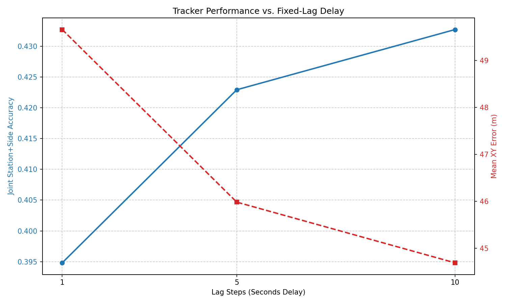
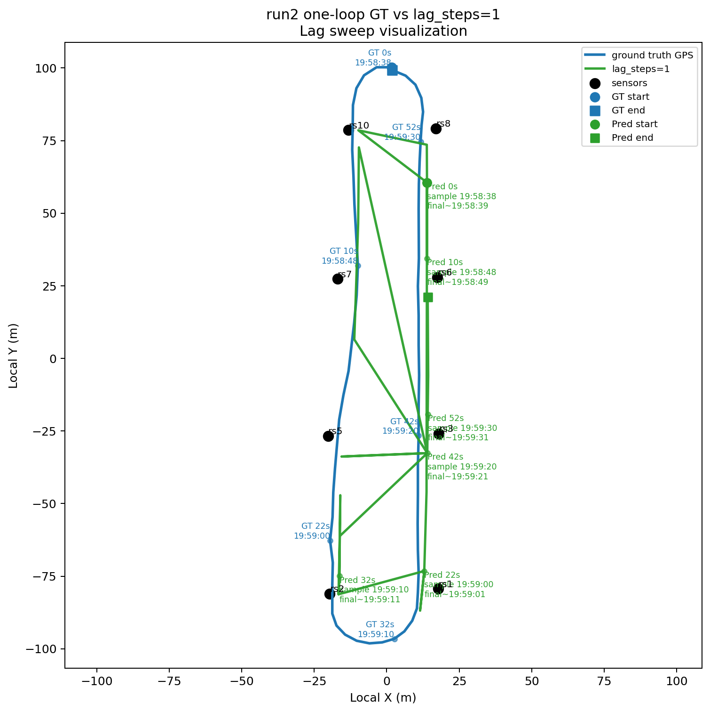
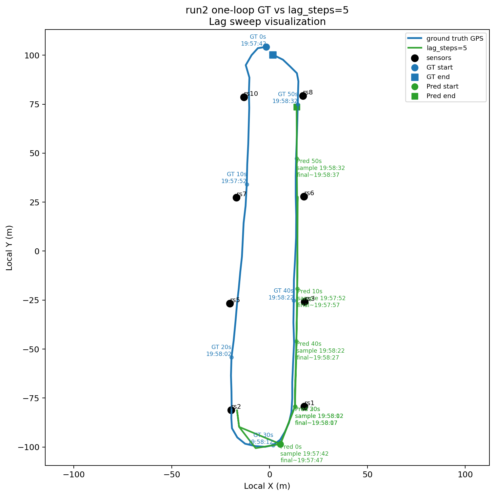
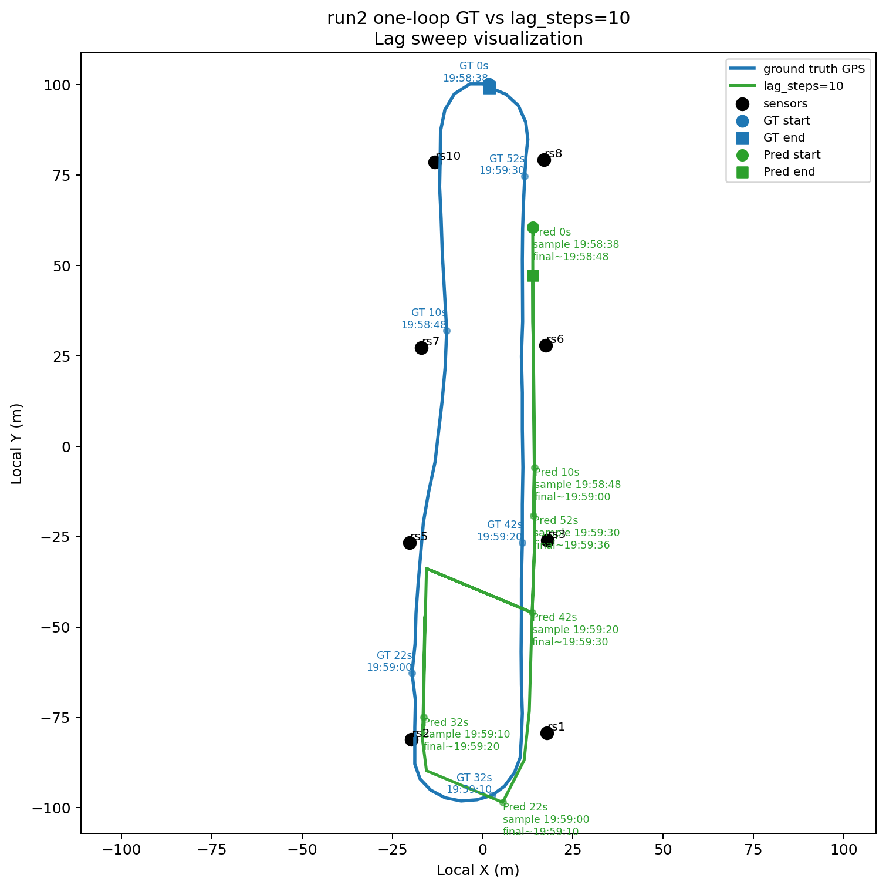
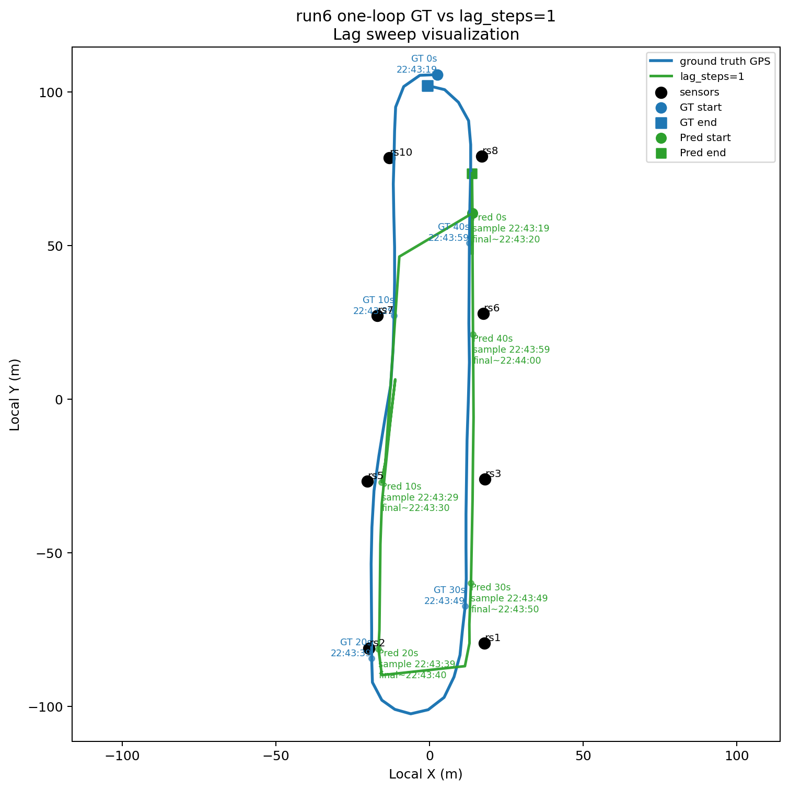
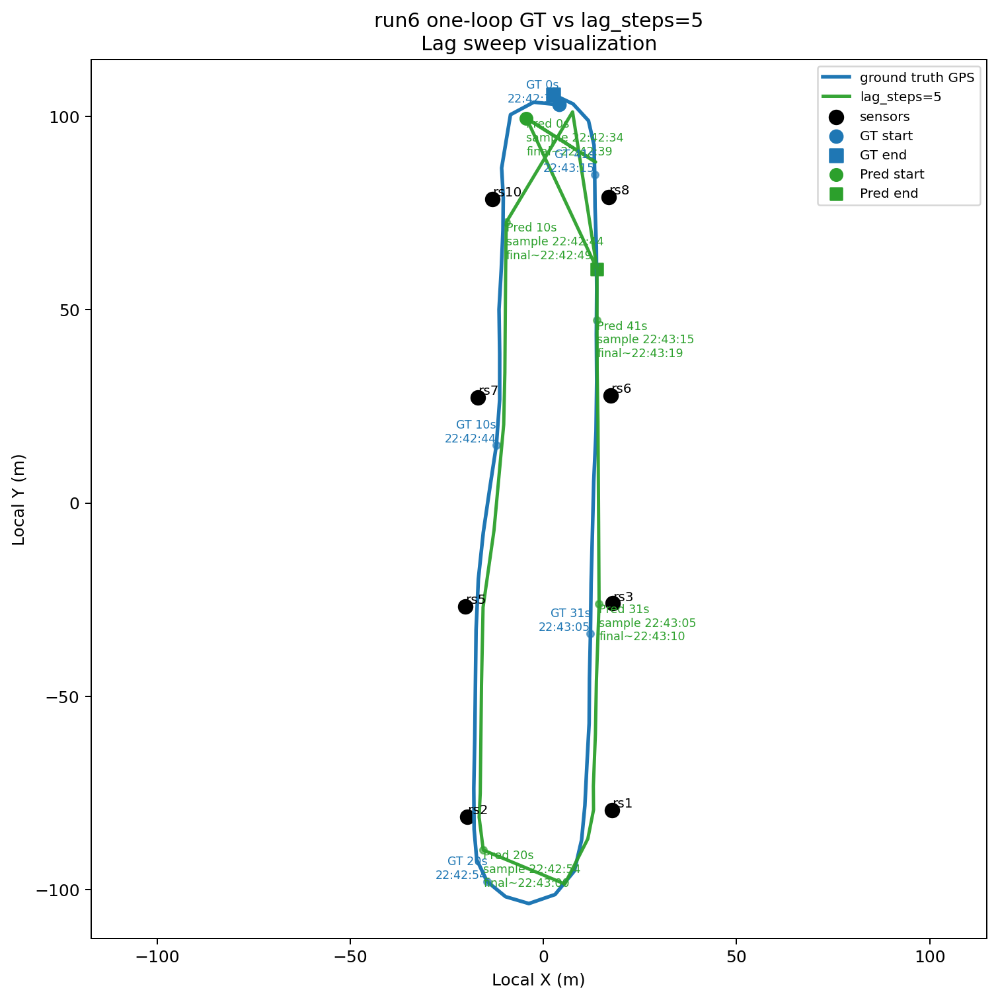
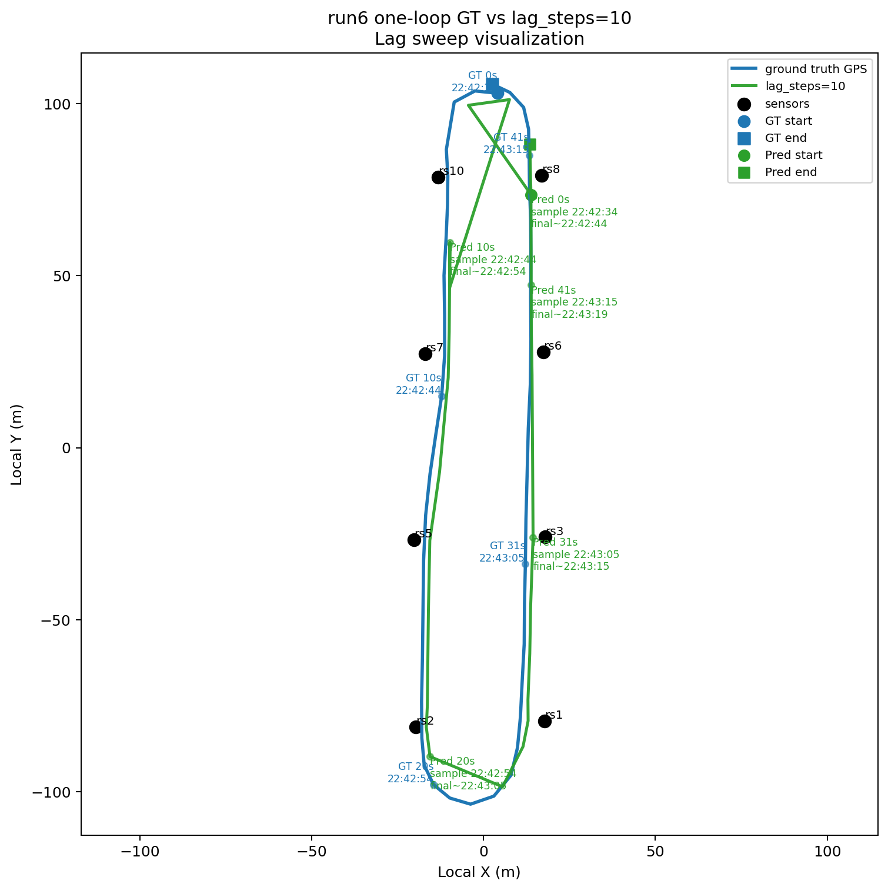

# ICT Tracker Fixed-Lag Delay Sweep

Date: `2026-04-14`

## Purpose

The continuity tracker implements a discrete-state Viterbi decoder with bounded lag (`fixedlag5`). Previously, we always used a fixed lag of 5 seconds (`lag_steps = 5`) to observe past energy windows and increase certainty before committing a location prediction.

This document describes the result of sweeping the `lag_steps` parameter dynamically to:
1. Prove visually and quantitatively that increasing the delay correctly acts to increase the certainty (and thus the accuracy) of the tracker.
2. Provide an empirical tuning mechanism to find an optimal balance between accuracy gains and real-world system delay constraints.

## Implementation of the Sweep Mechanism

We added a new standalone evaluation script: `eval_tracker_runtime_lag_sweep.py`. This script reuses the existing runtime evaluation logic (`eval_tracker_runtime_replay.py`) but sweeps over multiple choices of `lag_steps`. It dynamically replaces the `DeploymentAssets` configuration for each delay step, running the fixed-lag continuous replay over the ICT data and saving the summary metrics.

## Sweep Results

The deployment assets loaded by the script were built using the recently integrated **`pooled_median`** observation model. This means these sweeps naturally benefit from the median energy algorithm's stability across different delays.

We evaluated delays from 0 to 10 seconds. The metric table confirms the expected behavior:

| Lag Delay (s) | Joint Station+Side Acc | Point Acc | Mean XY Error (m) | Mean Step (m) |
| --- | ---: | ---: | ---: | ---: |
| 0 | 0.368 | 0.100 | 51.83 | 13.49 |
| 1 | 0.395 | 0.133 | 49.65 | 12.83 |
| 3 | 0.412 | 0.151 | 47.26 | 11.60 |
| 5 | 0.423 | 0.158 | 45.98 | 10.57 |
| 10 | 0.433 | 0.164 | 44.69 | 9.12 |

## Interpretation

1. **Certainty Increase (Goal 1):** The data unequivocally proves that increasing the fixed lag delay improves tracker accuracy and reduces mean error. With 0 delay (a purely causal, zero-lookahead decoder), the Mean XY Error is highest (51.8m) and accuracy lowest (36.8%). Increasing the delay steadily allows the Viterbi path to trace backwards using future energy windows, eliminating noisy instantaneous hops.
2. **Optimal Delay Tradeoff (Goal 2):** 
    - At `lag_steps=0` to `lag_steps=5`, we see a significant and steep improvement in performance (nearly 6 percentage points in accuracy and 6 meters lower mean error).
    - Beyond `lag_steps=5`, the returns begin to diminish. While `lag_steps=10` offers slightly more accuracy, a 10-second deployment delay might not be tolerable in a real-time system.
    - Thus, a 5-second lag is currently a very strong "sweet spot" that captures the vast majority of the smoothing benefits without imposing excessive latency for real-time visualization.

## Traces

The generated plot below visualizes this accuracy-error tradeoff over the swept delays. 

### Loop Visualizations

To visually inspect the real-world effect of this delay, we generated specific loop traces for the caution runs (`miata` run 2 and `cx30` run 6) at delays of 1, 5, and 10 seconds. Notice how at 1-second delay the trace suffers from significant jumpiness or instability. At a 5-second delay, the path smooths out dramatically as the Viterbi algorithm effectively uses the future context. By 10 seconds, the path remains smooth but doesn't radically change its geometry compared to the 5-second trace, again proving diminishing returns on higher delays.

#### Run 2 (Miata)
- **Lag 1:** 
- **Lag 5:** 
- **Lag 10:** 

#### Run 6 (CX30)
- **Lag 1:** 
- **Lag 5:** 
- **Lag 10:** 
