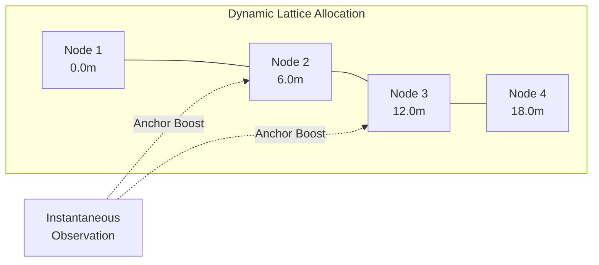

# Continuity Tracker: Algorithm Overview
**Date:** 2026-04-15

*This document outlines the step-by-step lifecycle of sensor data processing, designed for technical presentation slides.*

---

## Slide 1: The Lifecycle of a 1-Second Data Window
**High-Level Architecture**

The Continuity Tracker processes incoming acoustic data in discrete windows (e.g., 1-second frames), translating raw multi-sensor features into a continuous, smoothed physical trajectory. The system is designed around a delayed-decision model to ensure spatial stability.

```mermaid
flowchart LR
    A[1s Window\nRaw Features] --> B[Feature\nNormalization]
    B --> C[Instantaneous\nState Estimator]
    C --> D[Lattice\nEmission Scoring]
    D --> E[5-Second Fixed-Lag\nDP Decoder]
    E --> F[Smoothed Output\n(Lat, Lon, X, Y)]
    
    style E fill:#e1f5fe,stroke:#4CAF50,stroke-width:2px
```

---

## Slide 2: Phase 1 - Instantaneous State Estimation
**What happens immediately after a 1-second window is observed?**

Before looking at historical trajectories, the `HybridMicRuntime` evaluates the current 1-second frame in isolation to generate heuristic constraints:

*   **Acoustic Centroid Calculation:** Normalized features are scored across all physical stations. A temperature-scaled softmax determines the fractional "center of mass" for the acoustic energy.
*   **Lateral Positioning:** The system evaluates features against the cross-section geometry of the dominant station to determine the lateral side (`positive_cross` vs. `negative_cross`).
*   **Directional Inference:** The estimator maintains a short rolling buffer of recent centroids. By analyzing the median delta of this sequence, it infers an instantaneous movement vector (e.g., `toward_S1`, `toward_S4`).
*   **Inertia & Fallback:** Station transitions are gated by confidence margins to prevent high-frequency bouncing. If the acoustic margin falls below a threshold, it falls back to a nearest-neighbor template match.

---

## Slide 3: Phase 2 - Physical Lattice Mapping (Emission)
**Aligning the instantaneous observation with the physical road topology.**

The 1-second observation is projected onto a **1D Continuity Lattice**—a discretized model of the physical road.

*   **Dynamic Road Polyline Tuning (April 2026 Update):** Instead of allocating a fixed number of nodes per sensor segment (which caused spatial bunching and trajectory "jumpbacks" due to variable sensor spacing), the lattice is now dynamically allocated based on exact physical distance.
*   **Even Distribution:** Nodes are placed at consistent physical intervals (e.g., 6.0m) strictly along the road tangent.
*   **Emission Scoring:** Each lattice node receives a combined score based on:
    1.  *Template Match:* Euclidean similarity between the 1-second features and the node's offline acoustic signature.
    2.  *Spatial Anchor:* A confidence-weighted probability boost for nodes physically adjacent to the estimated Acoustic Centroid.



---

## Slide 4: Phase 3 - Fixed-Lag Sequence Smoothing
**How the system uses the 5-second buffer to finalize predictions.**

The tracker does not immediately output the best guess for the current frame. It uses a **Fixed-Lag Viterbi Decoder** to enforce physical continuity over time.

*   **The Trellis:** The system maintains a Dynamic Programming (DP) trellis of the last $N$ frames (e.g., a 5-frame/5-second lag).
*   **Transition Physics:** As the current 1-second frame is added to the trellis, transition scores are applied between $t-1$ and $t$:
    *   *Hop Penalty:* Heavily penalizes unphysical velocity (jumping multiple nodes in 1 second).
    *   *Direction Constraints:* Rewards transitions that match the inferred instantaneous direction; penalizes contradictory movement.
    *   *Stay Penalty:* Discourages the track from hovering indefinitely at a single node.
*   **Traceback & Commit:** At time $t$, the system identifies the most probable current node. It then traces the optimal path backwards through the 5-second buffer. The node at $t-5$ is formally committed and emitted as the final output. This look-ahead smoothing effectively filters out transient acoustic noise and ensures a continuous, monotonic trajectory.