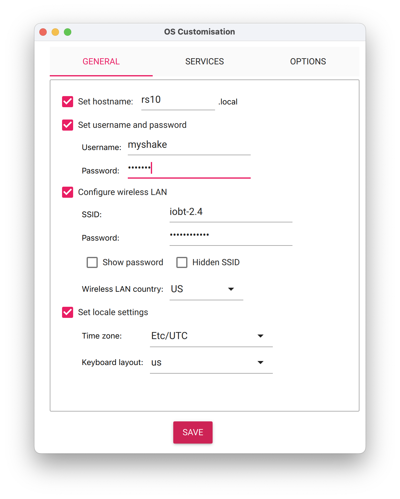

# Getting Started

## Installing Dependencies

### Python Environment Management

This project uses [`uv`](https://docs.astral.sh/uv) (or its predecessor [`rye`](https://rye.astral.sh)) to manage the Python environment.

To check if `rye` is already installed, run:

```bash
which rye
```

- If the command prints a path, `rye` is available and you can skip this step.
- If not, we recommend installing `uv` for new setups. Follow [uv’s official installation guide](https://docs.astral.sh/uv/getting-started/installation/).

For backward compatibility, you may also install [rye](https://rye.astral.sh/guide/installation/).

### Clone and install dependencies

```bash
$ git clone https://github.com/acies-os/controller.git
$ cd controller
controller$ uv sync

# or, if using rye
controller$ rye sync
```

### Install `just`

Install `just` use [your package manager](https://just.systems/man/en/packages.html) or [pre-built binary](https://just.systems/man/en/pre-built-binaries.html).

### Install `zenohd`

For x86_64 linux:

```bash
wget https://github.com/eclipse-zenoh/zenoh/releases/download/0.11.0/zenoh-0.11.0-x86_64-unknown-linux-gnu-standalone.zip
```

For aarch64 linux:

```bash
wget https://github.com/eclipse-zenoh/zenoh/releases/download/0.11.0/zenoh-0.11.0-aarch64-unknown-linux-gnu-standalone.zip
```

For aarch64 macOS:

```bash
wget https://github.com/eclipse-zenoh/zenoh/releases/download/0.11.0/zenoh-0.11.0-aarch64-apple-darwin-standalone.zip
```

To unzip the downloaded file, use the following command:

```bash
unzip zenoh-0.11.0-<platform>-standalone.zip
```

Replace `<platform>` with the appropriate platform identifier (e.g., `x86_64-unknown-linux-gnu`, `aarch64-unknown-linux-gnu`, or `aarch64-apple-darwin`).

To verify the installed version, run:

```bash
./zenohd --version
```

Ensure the output shows version `v0.11.0`.

(rpi-setup)=
## Set Up A New Raspberry Pi/Shake

1. Install [Raspberry Pi Imager](https://www.raspberrypi.com/software/) on the command machine.

2. Start the imager app, select

   - Device: Raspberry Pi 4
   - Operating System: `Ubuntu Server 22.04.4 LTS (64-bit)`
   - Storage: the SD card

   
   
   

   The imager app should take care of downloading the OS, formatting the SD card
   and write the new image. Here are few commands for doing things in command
   line on macOS in case of need:

   Find the SD card:

   ```shell
   $ diskutil list
   # ...
   # some other disks
   # ...
   /dev/disk2 (external, physical):
     #:                       TYPE NAME                    SIZE       IDENTIFIER
     0:     FDisk_partition_scheme                        *127.9 GB   disk2
     1:             Windows_FAT_32 boot                    66.1 MB    disk2s1
     2:                      Linux                         127.8 GB   disk2s2
   ```

   Format the SD card:

   ```shell
   diskutil eraseDisk FAT32 SDCARD MBRFormat "$TARGET_DISK"
   ```

   Write image to the SD card:

   ```shell
   diskutil unmountDisk "$TARGET_DISK"
   dd bs=4M if=<image_file> of="$TARGET_DISK" status=progress && sync
   ```

3. Open the router admin page, in the wireless client page, find the temporary IP of the new board.

   ```shell
   $ ssh-copy-id -i ~/.ssh/id_rsa.pub myshake@<tmp_ip>
   $ ssh myshake@<tmp_ip>
   myshake@rsn$: sudo visudo
   # add to the end of the file
   myshake ALL=(ALL) NOPASSWD: ALL
   ```

4. On the command machine, open a terminal in this repo and run

   ```shell
   # just boarding_party <tmp_ip> <static_ip> <vpn_ip> <node_name> all
   just boarding-party 10.7.0.33 10.7.0.9 10.8.0.9 rs6 all
   ```

   The `all` tag will run every task defined in the `boarding_party.yaml`
   playbook. If you want to run part of the playbook, you can check the content
   of the file or list the tasks and tags by running:

   ```shell
   $ just list-boarding-party
   ansible-playbook boarding_party.yaml --list-tasks

   playbook: boarding_party.yaml

      play #1 (all): Bootstrap new shakes.	TAGS: []
       tasks:
         Create .ssh folder.	TAGS: []
         Set authorized key taken from file	TAGS: [all, ssh]
         Copy myshake keys.	TAGS: [all, ssh]
         Back up configs.	TAGS: [all, backup]
         Set static IP with interfaces.	TAGS: [deprecated]
         Set static IP with dhcpcd.conf.	TAGS: [deprecated]
         Config WiFi.	TAGS: [wifi]
         Copy /etc/hosts.	TAGS: [all, config]
         Set hostname.	TAGS: [all, hostname]
         Apt update.	TAGS: [all, update]
         Apt install packages.	TAGS: [all, install]
         Config avahi-daemon.	TAGS: [all, avahi]
         Start and enable avahi-daemon.	TAGS: [all, avahi]
         Create Wireguard keys.	TAGS: [all, vpn]
         Change file mode for the private key.	TAGS: [all, vpn]
         Get private key to generate config.	TAGS: [all, vpn]
         Generate Wireguard client config.	TAGS: [all, vpn]
         Start wg0.service	TAGS: [all, vpn]
         Get public key for server command.	TAGS: [all, vpn]
         Print command to run on Wireguard server.	TAGS: [all, vpn]
         Set up Bash profile.	TAGS: [all, bash]
         Set up bashrc.	TAGS: [all, bash]
         Remove conflicting packages with docker.	TAGS: [all, docker]
         Set up the docker apt repository	TAGS: [all, docker]
         Install Ubuntu GPG key	TAGS: [all, docker]
         Install docker.	TAGS: [all, docker]
         Create docker group.	TAGS: [all, docker, docker-group]
         Add user to docker group.	TAGS: [all, docker, docker-group]
         Enable docker.service.	TAGS: [all, docker, docker-daemon]
         Enable containerd.service.	TAGS: [all, docker, docker-daemon]
         Copy myshake keys.	TAGS: [all, docker, docker-registry]
         Back up GPSD and NTP configs.	TAGS: [all, gpsd]
         Config gpsd.	TAGS: [all, gpsd]
         Config ntp with gpsd.	TAGS: [all, gpsd]
         Reboot.	TAGS: [all, reboot]
         Debug command.	TAGS: [debug]
   ```

   For example, to only run SSH related tasks, you can replace `all` with `ssh`:

   ```shell
   # Replace `all` with `ssh`` here --------------------v
   just boarding-party 10.7.0.33 10.7.0.9 10.8.0.9 rs6 ssh
   ```

5. Enable serial port. Run the command on the Pi:

   ```shell
   $ sudo raspi-config
   -> 3 Interface Options
   -> I6 Serial Port
   -> Would you like a login shell to be accessible over serial? <No>
   -> Would you like the serial port hardware to be enabled? <Yes>
   -> Finish and reboot
   ```

6. If you want to check the output from `/dev/ttyS0`, config the port with

   ```shell
   stty -F /dev/ttyS0 230400 min 0 time 5 ignbrk -brkint -imaxbel -opost -onlcr -isig -icanon -iexten -echo -echoe -echok -echoctl -echoke
   ```

7. Check `dmesg` output for low voltage warning. To reduce power consumption:

   Disable HDMI output.

   ```shell
   sudo apt install libraspberrypi-bin
   ```

   Then append the following to `/etc/rc.local` before `exit 0` line:

   ```text
   /opt/vc/bin/tvservice -o
   ```

   If this is not enough, limit the CPU frequency by adding the following line to `/boot/config.txt`

   ```text
   [all]
   arm_freq=1300
   ```

   See the Raspberry Pi
   [manual](https://www.raspberrypi.com/documentation/computers/config_txt.html)
   for CPU frequency and info about `arm_freq`.

   [Frequency Management and Thermal Control](https://www.raspberrypi.com/documentation/computers/raspberry-pi.html#frequency-management-and-thermal-control)

8. Enable swapfile.

   ```shell
   $ sudo apt install -y dphys-swapfile
   $ sudo dphys-swapfile swapoff
   $ sudo vim /etc/dphys-swapfile
   # change the line to
   CONF_SWAPSIZE=1024
   $ sudo dphys-swapfile setup
   $ sudo dphys-swapfile swapon
   ```

9. Then reboot.
